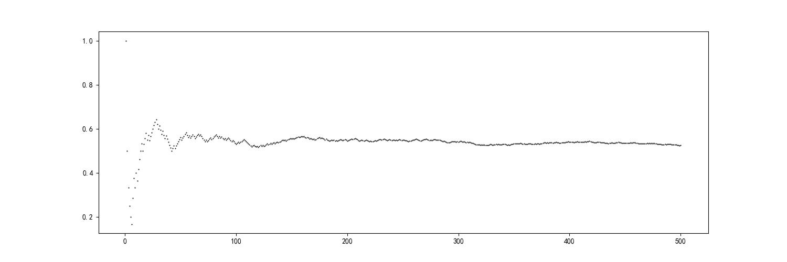

## HW2

#### Q1

证明：由于 $A+B=A+(B-A)=A+(B-AB)$，且 $A$ 与 $B-AB$ 互斥，$AB \subset B$，因此对于任意 $A,B$，我们有

$$
\begin{align}
P(A+B)=&P(A)+P(B-AB)\\
=&P(A)+P(B)-P(AB)
\end{align}
$$

因此

$$
\begin{align}
P(A+B+C)=&P(A+B)+P(C)+P((A+B)C)\\
=& P(A+B)+P(C)+P(AC+BC)\\
=& (P(A)+P(B)-P(AB))+P(C)+(P(AC)+P(BC)-P(AC \cap BC))\\
=& P(A)+P(B)+P(C)-P(AB)-P(BC)-P(AC)+P(ABC)
\end {align}
$$

#### Q2

证明：下面证明 $P(·|B):\mathscr{F}\rightarrow \mathbb{R}$ 满足概率函数的三条公理化映射：

1. $P(A|B)=\dfrac{P(AB)}{P(B)}\geqslant 0,\forall A\in \mathscr{F} $

2. $P(\Omega|B)=P(\Omega B|B)=P(B|B)=\dfrac{P(B)}{P(B)}=1$

3. $A_i \in \mathscr{F}, \forall i \in \mathbb{N^*},A_iA_j=\varnothing,\forall i \not= j$，我们有

$$
P(\sum_{i=1}^{\infty}{A_i}|B)=\frac{P(\sum_{i=1}^{\infty}{A_i}B)}{P(B)}=\frac{\sum_{i=1}^{\infty}{P({A_i}B)}}{P(B)}=\sum_{i=1}^{\infty}\frac{{P({A_i}B)}}{P(B)}=\sum_{i=1}^{\infty}{P({A_i}|B)}
$$

   因此， $P(·|B)$ 是概率函数。

#### Q3

​	(1) 不正确。若 $B=A\not= \Omega$ ，那么 $P(A|B)=1$ 而 $P(A)<1$，结论不成立。

​	(2) 不正确。考虑空事件 $A=\varnothing$，那么对于任意事件 $B$，$AB=\varnothing$，且 $P(AB)=0$，于是 $A,B$ 既互斥也相互独立。

​	(3) 不正确。$A,B,C$ 独立指的是 $P(ABC)=P(A)P(B)P(C)$ 且 $A,B,C$ 两两独立，仅由 $P(ABC)=P(A)P(B)P(C)$ 无法推出 $A,B,C$ 两两独立，因此无法推出 $A,B,C$ 独立。

#### Q4

|      |  1   |  2   |  3   |  4   |  5   |  6   |
| :--: | :--: | :--: | :--: | :--: | :--: | :--: |
|  1   |  2   |  3   |  4   |  5   |  6   |  7   |
|  2   |  3   |  4   |  5   |  6   |  7   |  8   |
|  3   |  4   |  5   |  6   |  7   |  8   |  9   |
|  4   |  5   |  6   |  7   |  8   |  9   |  10  |
|  5   |  6   |  7   |  8   |  9   |  10  |  11  |
|  6   |  7   |  8   |  9   |  10  |  11  |  12  |

于是，我们有

$$
\begin{align}
P(A_2)&=\frac{18}{36}=\frac{1}{2}\\
P(A_3)&=\frac{12}{36}=\frac{1}{3}\\
P(A_5)&=\frac{7}{36}\\
P(A_6)&=\frac{6}{36}=\frac{1}{6}\\
P(A_{10})&=\frac{3}{36}=\frac{1}{12}\\
\end{align}
$$

因为 $P(A_2A_3)=P(A_6)=P(A_2)P(A_3)$，所以 $A_2$ 与 $A_3$ 相互独立。

因为  $P(A_2A_5)=P(A_10)\not=P(A_2)P(A_5)$，所以 $A_2$ 与 $A_5$ 不相互独立。

#### Q5

条件独立 $\not \Rightarrow$ 独立：

投掷骰子一枚，记 $A$ 为点数为 $1$，$B$ 为点数为 $1$ 或 $2$，$C=B$。显然，我们有 $P(A|C)=\frac{1}{2},P(B|C)=1,P(AB|C)=\frac{1}{2}$。此时 $P(AB|C)=P(A|C)P(B|C)$，$A,B$ 关于 $E$ 条件独立，但 $P(AB)\not= P(A)P(B)$。因此条件独立 $\not \Rightarrow$ 独立。

独立 $\not \Rightarrow$ 条件独立：

投掷一枚骰子，记 $A$ 为点数为 $1$ 或 $2$ 或 $3$，$B$ 为点数为 $3$ 或 $4$，$C$ 为点数为 $3$ 或 $6$。我们有 $P(A)=\frac{1}{2}，P(B)=\frac{1}{3},P(AB)=\frac{1}{6}$，$A,B$ 独立，但 $P(A|C)=\frac{1}{2},P(B|C)=\frac{1}{2},P(AB|C)=\frac{1}{2}$，于是 $P(AB|C)\not=P(A|C)P(B|C)$，$A,B$ 并非关于 $C$ 条件独立。因此独立 $\not \Rightarrow$ 条件独立。

综上，条件独立不意味着独立，反之亦然。

#### Q6

记 $A_i$ 为第 $i$ 次试验中事件 $A$ 发生的概率。则每次试验的结果相互独立，记 $B$ 为事件 $A$ 迟早要发生，由于 $0<\varepsilon < 1$，我们有

$$
P(B)=\lim_{n\rightarrow \infty}(1-(1-P(A))^n)=1-\lim_{n\rightarrow \infty}(1-\varepsilon)^n=1
$$

因此事件 $A$ 迟早要发生的概率为 $1$.

#### Q7

记事件 $A$ 为随机取出一张放在桌上，朝上的面为红色，$B$ 为随机取出一张放在桌上，朝下的面为黑色，那么我们有

$$
\begin{align}
&P(A)=\frac{1}{3}\times0+\frac{1}{3}\times \frac{1}{2}+\frac{1}{3}\times 1=\frac{1}{2}\\
&P(AB)=\frac{1}{3}\times \frac{1}{2}=\frac{1}{6}\\
\end{align}
$$

于是另一面是黑色的概率为

$$
P(B|A)=\frac{P(AB)}{P(A)}=\frac{1}{3}
$$

#### Q8

(1) 公平。在这种情况下，显然结果与抓阄顺序无关，每人中奖概率均为 $\frac{1}{n}$。

(2) 公平。记 $A_i$ 为第 $i$ 次抓阄抓中并结束。那么

$$
P(A_i)=(1-\frac{1}{n})(1-\frac{1}{n-1})...(1-\frac{1}{n-i+2})\frac{1}{n-i+1}=\frac{1}{n}
$$

因此 $P(A_i)$ 恒为 $\frac{1}{n}$，与抓阄顺序无关，仍为公平的。

#### Q9

 记 $A$ 为小明患有这种疾病，$B$ 为小明检查结果呈阳性，则根据贝叶斯公式
 
$$
P(A|B)=\frac{P(B|A)P(A)}{P(B|A)P(A)+P(B|\bar{A})P(\bar{A})}=\frac{0.6}{0.6+0.3\times 0.4}=\frac{5}{6}>0.8
$$

所以应该仍旧建议手术。

#### Q10

(1) 定义 $A_{i}$ 为游戏币为 $i$ 个时，最终以输光的方式离场。根据题意，我们有

$$
P(A_i)= (1-p)P(A_{i-1})+pP(A_{i+1})
$$

其中 $P(A_0)=1,P(A_n)=0$，由此可得

$$
P(A_i)=\left\{
\begin{align}
&\frac{(\frac{1-p}{p})^i-(\frac{1-p}{p})^n}{1-(\frac{1-p}{p})^n},&p\not=0.5\\
&1-\frac{i}{n},&p=0.5
\end{align}
\right.
$$

(2) 若 $0<p<0.5$，$\frac{1-p}{p}>1$，当 $n\rightarrow\infty$ 时，

$$
P(A_i)=\lim_{n\rightarrow \infty}\frac{(\frac{1-p}{p})^i-(\frac{1-p}{p})^n}{1-(\frac{1-p}{p})^n}=1
$$

若 $p=0.5$，当 $n\rightarrow\infty$ 时，

$$
P(A_i)=\lim_{n\rightarrow \infty}(1-\frac{i}{n})=1
$$

故输光离场概率的极限为 $0.5$.

#### Q11

记 $p_i$ 为有 $n$ 只生物时，最终走向灭亡的概率，则 $p_n=p_1^n$，根据题意，可得

$$
p_1=\frac{1}{3}+\frac{1}{3}p_1+\frac{1}{3}p_2=\frac{1}{3}+\frac{1}{3}p_1+\frac{1}{3}p_1^2
$$

解得 $p_1=1$，因此这种生物最终灭亡的概率是 $1$.

#### Q12

由全概率公式，选择甲、乙方案最终被治愈的概率分别为

$$
p_甲=0.8\times0.8+0.1\times0.05+0.1\times0.1=0.655\\
p_乙=0.8\times0.6+0.1\times0.9+0.1\times0.9=0.66
$$

由于 $p_甲<p_乙$，我给出乙治疗方案。

甲方案也有被建议的理由，甲、乙两方案最终治愈率差别不大，况且患者确诊为病症 A 的概率很大，在这种情况下，甲方案的治愈率大于乙。

#### Q13

(1) 由全概率公式得

$$
P(B_1)=P(U_1)P(B_1|U_1)+P(U_2)P(B_1|U_2)=\frac{1}{2}\times\frac{4}{5}+\frac{1}{2}\times\frac{2}{5}=\frac{3}{5}\\
P(U_1|B_1)=\frac{P(U_1B_1)}{P(B_1)}=\frac{\frac{1}{2}\times\frac{4}{5}}{\frac{3}{5}}=\frac{2}{3}>P(U_1)=\frac{1}{2}
$$

由于袋子 $U_1$ 中的黑球更多，所以如果已知第一次取出的是黑球，那么它出自袋子 $U_1$ 的可能性更大。

(2) 若放回，那么第2次取球与第1次取球效果相同，$P(B_2)=P(B_1)=\frac{3}{5}$。

若不放回，根据全概率公式，有

$$
\begin{align}
P(B_2)&=P(U_1)P(B_2|U_1)+P(U_2)P(B_2|U_2)\\
&=\frac{1}{2}\times (\frac{4}{5}\times\frac{3}{4}+\frac{1}{5}\times1)+\frac{1}{2}\times (\frac{2}{5}\times\frac{1}{4}+\frac{3}{5}\times\frac{2}{4})\\
&=\frac{3}{5}
\end{align}
$$

若取出第1个球但不看其颜色，那么在不放回袋子的情况下，取出黑球的概率与取球次序无关，这与抓阄的原理类似。

(3) 由全概率公式得，

$$
P(B_2|B_1)=\frac{P(B_1B_2)}{P(B_1)}=\frac{P(U_1)P(B_1B_2|U_1)+P(U_2)P(B_1B_2|U_2)}{P(B_1)}=\frac{\frac{1}{2}\times(\frac{4}{5})^2+\frac{1}{2}\times(\frac{2}{5})^2}{\frac{3}{5}}=\frac{2}{3}
$$

可见 $P(B_2|B_1)>P(B_2)$，这是因为若已知第一次取出的是黑球，那么它出自袋子 $U_1$ 的概率更大，那么第二次从袋子 $U_1$ 中取球的概率就更大，自然第二次取出黑球的概率就大。 

(4) 由全概率公式得，

$$
\begin{align}
P(B_{n+1}|B_1B_2...B_n)&=\frac{P(B_1B_2...B_{n+1})}{P(B_1B_2...B_n)}\\
&=\frac{P(U_1)P(B_1B_2...B_{n+1}|U_1)+P(U_2)P(B_1B_2...B_{n+1}|U_2)}{P(U_1)P(B_1B_2...B_{n}|U_1)+P(U_2)P(B_1B_2...B_{n}|U_2)}\\
&=\frac{P(B_1B_2...B_{n+1}|U_1)+P(B_1B_2...B_{n+1}|U_2)}{P(B_1B_2...B_{n}|U_1)+P(B_1B_2...B_{n}|U_2)}\\
&=\frac{(\frac{4}{5})^{n+1}+(\frac{2}{5})^{n+1}}{(\frac{4}{5})^n+(\frac{2}{5})^n}\\
&=\frac{4}{5}(1-\frac{1}{2^{n+1}+2})
\end{align}
$$

令 $n\rightarrow\infty$，那么 $\lim_{n\rightarrow\infty}P(B_{n+1}|B_1B_2...B_n)=\lim_{n\rightarrow\infty}\frac{4}{5}(1-\frac{1}{2^{n+1}+2})=\frac{4}{5}$

可以理解为当 $n$ 无穷大时，若前 $n$ 次取出的仍均为黑球，可以断定这是在袋子 $U_1$ 中取球，那么第 $n+1$ 次取出黑球的概率为 $\frac{4}{5}$。

(5) 由全概率公式得，

$$
P(U_1|B_1B_2...B_n)=\frac{P(U_1B_1B_2...B_n)}{P(B_1B_2...B_n)}=\frac{\frac{1}{2}\times(\frac{4}{5})^n}{\frac{1}{2}\times(\frac{4}{5})^n+\frac{1}{2}\times(\frac{2}{5})^n}=1-\frac{1}{2^n+1}
$$

令 $n\rightarrow\infty$，那么 $\lim_{n\rightarrow\infty}P(U_1|B_1B_2...B_n)=\lim_{n\rightarrow\infty}(1-\frac{1}{2^n+1})=1$

可以理解为当 $n$ 无穷大时，若前 $n$ 次取出的仍均为黑球，可以断定这是在袋子 $U_1$ 中取球，这是因为单次取球时，从袋子 $U_1$ 中取出黑球的概率比袋子 $U_2$ 大。

#### Q14

(1) 若仅选择一个对手参与打赌，那么我的选择取决于我对A队获胜的主观概率，将其设为 $p$，根据题意，

$$
P_甲(A)\geq\frac{20}{20+5}=0.8\\
P_乙(B)\geq\frac{15}{15+10}=0.6
$$

若 $p<0.8$，则**可**与甲打赌，若 $p>0.4$，则**可**与乙打赌。

综上，若 $p\leq0.4$，则与甲打赌，若 $p\geq0.8$，则与乙打赌，若 $0.4<p<0.8$，与甲、乙打赌均可。

为了必定获利，考虑用 $a$ 元与甲打赌，用剩下的 $100-a$ 元与乙打赌。那么我们有

$$
4a-(100-a)>0\ 且\ -a+1.5(100-a)>0
$$

解得 $20<a<60$，因此有必定获利的策略。

(2) 由 (1) 得，

$$
P_甲(B)=1-P_甲(A)\leq0.2\\
P_乙(A)=1-P_乙(B)\leq0.4
$$

因此 $P_甲(B)+P_乙(A)\leq0.6<1$。

联系 (1) 可知，由于甲、乙两人对自己赌赢的主观概率之和小于 $1$，所以存在必定获利的策略。

#### Q15

(1) 代码如下：
```python
import matplotlib.pyplot as plt
import random

plt.figure(figsize=(15, 5))

sum = 0; n = 1000; p = 0.3

for i in range(1, n + 1):
    x = random.random()
    if x < p:
        sum += 1
    freqency = sum / i
    plt.scatter(i, freqency, c='black', s = 0.3)

plt.show()
```

运行后生成如下图所示的散点图：


(2) 代码如下：
```python
import matplotlib.pyplot as plt
import random

sums = []

for i in range(1, 101):
    sum = 0; n = 1000; p = 0.3
    for j in range(1, n + 1):
        x = random.random()
        if x < p:
            sum += 1
    sums.append(sum)

del sum
average = sum(sums) / len(sums)
print(average)

plt.hist(sums, bins = 10, edgecolor = 'black')
plt.xlabel('正面向上的次数')
plt.ylabel('频数')
plt.show()
```

运行后生成如下图所示的直方图：


(3) 上面的代码计算并输出了平均值 $average=300.19$，而 $np=300$，两者十分接近。

(4) 例如取 $p=0.5,n=500$，得到的散点图，直方图如下：




正面向上次数的平均值 $average=251.0$，而 $np=250$，两者也十分接近。
