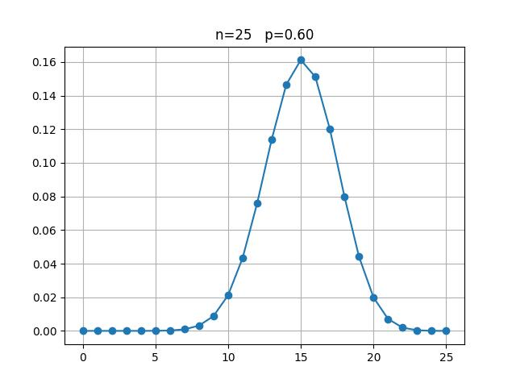

## HW3

#### Q1

1. 抛100次1元硬币，正面向上的次数。离散型，样本空间 $\Omega=\{{正面，反面}\}^{100}$。
2. 抛一枚骰子，向上的点数。离散型，样本空间 $\Omega=\{1，2，3，4，5，6\}$。
3. 在某家电市场随机抽一个电冰箱，它的使用寿命。连续性，样本空间 $\Omega=该家电市场中所有电冰箱之集$。
4. 2023年中随机抽取一个月，海淀区下雨的天数。离散型，样本空间 $\Omega=2023年所有月份之集$。
5. 在某班随机抽取一位同学，TA的体重。连续性，样本空间 $\Omega=该班所有同学之集$。

#### Q2

(1) 证明：定义事件 $A_n=\{X\leq -n\}$，那么 $A_n\supset A_{n+1}$，于是 $\prod_{i=1}^{+\infty}A_i=\varnothing$，所以

$$
\lim_{x\rightarrow -\infty}F(x)=\lim_{n\rightarrow +\infty}P(A_n)=P(\prod_{i=1}^{+\infty}A_i)=0
$$

定义事件 $B_n=\{X\leq n\}$，那么 $B_n\subset B_{n+1}$，于是 $\sum_{i=1}^{+\infty}A_i=\Omega$，所以

$$
\lim_{x\rightarrow +\infty}F(x)=\lim_{n\rightarrow +\infty}P(B_n)=P(\sum_{i=1}^{+\infty}B_i)=1
$$

(2) 证明：记 $A_n=\{X\leq x_0+\frac{1}{n}\}$，那么 $A_n\supset A_{n+1}$，且 $\prod_{i=1}^{+\infty}A_i=\{X\leq x_0\}$，于是

$$
\lim_{x\rightarrow{x_0^+}}F(x)=\lim_{n\rightarrow{+\infty}}F(x_0+\frac{1}{n})=\lim_{n\rightarrow{+\infty}}P(A_n)=P(\prod_{i=1}^{+\infty}A_i)=P(X\leq x_0)=F(x_0)
$$

(3) $P(a\leq X \leq b)=P(X\leq b)-P(X<a)=F(b)-F(a^-)$

#### Q3

(1) 易得 $P(\omega_1)=P(\omega_2)=P(\omega_3)=\frac{1}{3}$，$X$ 的分布表如下所示：

|  $X$   |       1       |       2       |       3       |
| :----: | :-----------: | :-----------: | :-----------: |
| $P(X)$ | $\frac{1}{3}$ | $\frac{1}{3}$ | $\frac{1}{3}$ |

$Y$ 的分布表如下所示：

|  $Y$   |       1       |       2       |       3       |
| :----: | :-----------: | :-----------: | :-----------: |
| $P(Y)$ | $\frac{1}{3}$ | $\frac{1}{3}$ | $\frac{1}{3}$ |

因此 $X,Y$ 这两个随机变量分布相同。

(2) $X+Y$ 的可能取值为：$3,4,5.$

$$
P(X+Y=3)=P(\omega_1)=\frac{1}{3}\\
P(X+Y=4)=P(\omega_3)=\frac{1}{3}\\
P(X+Y=5)=P(\omega_2)=\frac{1}{3}\\
$$

分布表如下：
|  $X+Y$   |       3       |       4       |       5       |
| :------: | :-----------: | :-----------: | :-----------: |
| $P(X+Y)$ | $\frac{1}{3}$ | $\frac{1}{3}$ | $\frac{1}{3}$ |

$Y-X$ 的可能取值为：$-2,1.$

$$
\begin{align}
&P(Y-X=1)=P(\omega_1)+P(\omega_2)=\frac{2}{3}\\
&P(Y-X=-2)=P(\omega_3)=\frac{1}{3}\\
\end{align}
$$

分布表如下：
|  $Y-X$   |      -2       |       1       |
| :------: | :-----------: | :-----------: |
| $P(Y-X)$ | $\frac{1}{3}$ | $\frac{2}{3}$ |

#### Q4

证明：设离散型随机变量 $X$ 的所有可能取值为 $x_i$，那么

$$
\begin{align}
Var(X)&=\sum_i(x_i-E(X))^2p_i\\
&=\sum_ix_i^2p_i-2E(X)\sum_ix_ip_i+E^2(X)\sum_ip_i\\
&=E(X^2)-2E^2(X)+E^2(X)\\
&=E(X^2)-E^2(X)
\end{align}
$$

定义并不一致，课上定义方差的前提是**期望存在**，而中学研究离散变量和定义方差时并没有考虑期望是否存在这一前置条件。

#### Q5

(1) 若每次取球后不放回，

$$
P(X=k)=\frac{\tbinom{a}{k-1}}{\tbinom{a+b}{k-1}}\times \frac{b}{a+b-k+1}=\frac{ba!(a+b-k)!}{(a-k+1)!(a+b)!}
$$

(2) 若每次取球后放回，

$$
P(X=k)={(\frac{a}{a+b})}^{k-1}\times \frac{b}{a+b}=\frac{ba^{k-1}}{(a+b)^k}\\
E(X)=\sum_{k=1}^{+\infty}kP(X=k)=\frac{b}{a+b}\sum_{k=1}^{+\infty}k{(\frac{a}{a+b})}^{k-1}=\frac{b}{a+b}\times\frac{1}{({\frac{a}{a+b}}-1)^2}=\frac{a+b}{b}
$$

#### Q6

存在。考虑以下离散随机变量 $X,Y$：

$X$ 的可能取值为 $\{1,2,...,99,10000\}$，$Y$ 的可能取值为 $\{100\}$。

且 $P(X=k)=\frac{1}{100},k\in\{1,2,...,99,10000\}$，$P(Y=100)=1$。

于是 $E(X)>10000P(X=10000)=100=E(Y)$，但 $P(Y>X)=P(X<100)=0.99$。

#### Q7

(1) $P(X=k)=p{(1-p)}^{k-1}$

(2) 期望和方差如下：

$$
E(X)=\sum_{k=1}^{+\infty}kp{(1-p)}^{k-1}=\frac{1}{p}\\
Var(X)=E(X^2)-E^2(X)=\sum_{k=1}^{+\infty}k^2p{(1-p)}^{k-1}-{(\frac{1}p)}^2=\frac{2-p}{p^2}-\frac{1}{p^2}=\frac{1-p}{p^2}
$$

#### Q8

根据题意，$X\sim B(25,0.6)$。于是
(1) $P(X\geq 15)\approx0.5858$
(2) $P(X>20)\approx0.0095$
(3) $P(X<10)\approx0.0132$

#### Q9

假设 $X\sim B(n,p)$，则 $P(X=k)=\tbinom{n}{k}p^k{(1-p)}^{n-k}$，那么我们有

$$
\begin{align}
E(X)&=\sum_{k=0}^{n}k\tbinom{n}{k}p^k{(1-p)}^{n-k}\\
&=\sum_{k=0}^{n}n\tbinom{n-1}{k-1}p^k{(1-p)}^{n-k}\\
&=np\sum_{k=1}^{n}\tbinom{n-1}{k-1}p^{k-1}{(1-p)}^{(n-1)-(k-1)}\\
&=np(p+(1-p))^{n-1}\\
&=np\\
E(X^2)&=\sum_{k=0}^{n}k^2\tbinom{n}{k}p^k{(1-p)}^{n-k}\\
&=\tbinom{n}{1}p{(1-p)}^{n-1}+\sum_{k=2}^{n}kn\tbinom{n-1}{k-1}p^k{(1-p)}^{n-k}\\
&=np{(1-p)}^{n-1}+n(\sum_{k=2}^{n}(k-1)\tbinom{n-1}{k-1}p^k{(1-p)}^{n-k}+\sum_{k=2}^{n}\tbinom{n-1}{k-1}p^k{(1-p)}^{n-k})\\
&=np{(1-p)}^{n-1}+n(\sum_{k=2}^{n}(n-1)\tbinom{n-2}{k-2}p^k{(1-p)}^{n-k}+\sum_{k=1}^{n}\tbinom{n-1}{k-1}p^k{(1-p)}^{n-k}-p{(1-p)}^{n-1})\\
&=np{(1-p)}^{n-1}+n((n-1)p^2(p+1-p)^{n-2}+p(p+1-p)^{n-1}-p{(1-p)}^{n-1})\\
&=np(1-p)+n^2p^2\\
Var(X)&=E(X^2)-E^2(X)\\
&=np(1-p)
\end{align}
$$

#### Q10

(1) $P(X=m)=\frac{\tbinom{M}{m}\tbinom{N-M}{n-m}}{\tbinom{N}{n}}$

(2) 根据估计，有 $\frac{M}{N}=\frac{m}{n}$，于是取 $N=[\frac{nM}{m}]$.

(3) 将 $P(X=m)$ 表示为关于 $N$ 的函数 $f(N)$，那么我们有

$$
\frac{f(N)}{f(N-1)}=\frac{(N-M)(N-n)}{N(N-M-n+m)}
$$

令 $\frac{f(N)}{f(N-1)}\geq 1$，解得 $N\leq \frac{nM}{m}$，于是当 $N=[\frac{nM}{m}]$ 时，$P(X=m)$ 值最大。比较可得，两值相等。

(4) 在这个例子中，$N$ 这个参数是待定的，但已知的是样本事件的试验结果 $m$。将让这个结果发生概率最大的参数值，作为待定参数的估计值，这就是极大似然估计思想。

#### Q11

代码如下：
```python
import numpy
import matplotlib.pyplot as plt
import math
from scipy import stats

n = 25
p = 0.6
k = numpy.arange(0, n + 1)
binomial = stats.binom.pmf(k,n,p)
# 期望
e = numpy.sum(k * binomial)
# 方差
var = numpy.sum(k**2 * binomial) - e**2
# 介于给定区间内的概率
K = numpy.arange(math.ceil(e - 2 * var**(1/2)), math.floor(e + 2 * var**(1/2)) + 1)
pos = sum(stats.binom.pmf(K,n,p))

print(e, var)
print(pos)

plt.plot(k, binomial, 'o-')
plt.title('n=%i   p=%.2f'%(n,p))
plt.grid(True)
plt.show()
```

绘得二项分布图如下：


(1) 根据二项分布图，$x=15$ 时有最大概率。

(2) 计算得 $\mu = 15$，这与最大概率对应的 $x$ 值的大小相同。

(3) 方差 $\sigma ^2=6$。

(4) 概率 $pos\approx0.9362$。