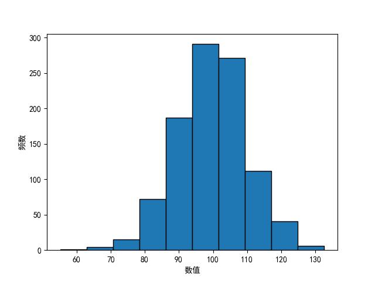
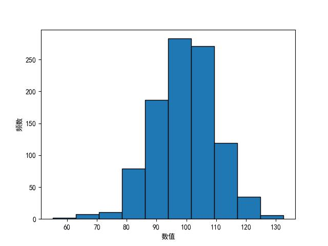

## HW4

#### Q1

记出现一点的骰子数为 $X$，则 $X\sim B(6,\frac{1}{6})$

$$
P(X=2)=\binom{6}{2}\times{(\frac{1}{6})}^2\times {(\frac{5}{6})}^4\approx 0.2009
$$

若近似为 Poisson 分布，则有 $X\sim P(1)$

$$
P(X=2)=\frac{e^{-1}}{2!}\approx 0.1839
$$

#### Q2

记该天访问该网站的人数为 $X$，则 $X\sim B(10^6,2\times 10^{-6})$

$$
P(X\geq 3)=1-P(X=0)-P(X=1)-P(X=2)\approx 0.3233
$$

若近似为 Poisson 分布，则有 $X\sim P(2)$

$$
P(X\geq 3)=1-P(X=0)-P(X=1)-P(X=2)\approx 0.3233
$$

#### Q3

记虫卵个数为 $X$，后代个数为 $Y$。那么我们有

$$
\begin{align}
P(Y=k)&=\sum_{n=k}^{+\infty}{P(X=n)P(Y=k|X=n)}\\&=\sum_{n=k}^{+\infty}{\frac{\lambda ^ne^{-\lambda}}{n!}\binom{n}{k}p^k({1-p})^{n-k}}\\&=\frac{e^{-\lambda}p^k}{k!}\sum_{n=k}^{+\infty}\frac{\lambda ^n{(1-p)}^{n-k}}{(n-k)!}\\&=\frac{e^{-\lambda}{(\lambda p)}^k}{k!}\sum_{n=0}^{+\infty}\frac{{(\lambda {(1-p)})}^n}{n!}\\&=\frac{{(\lambda p)}^ke^{-\lambda p}}{k!}
\end{align}
$$

因此 $Y\sim P(\lambda p)$，命题得证。

#### Q4

根据题意，我们有

$$
\left\{
\begin{align}
&\int_{-\infty}^{+\infty}f(x)dx=\int_0^1(a+bx^2)dx=a+\frac{1}{3}b=1\\
&E(X)=\int_{-\infty}^{+\infty}xf(x)dx=\int_0^1x(a+bx^2)dx=\frac{1}{2}a+\frac{1}{4}b=\frac{2}{3}
\end{align}
\right.
$$

解得 $a=\frac{1}{3},b=2$

#### Q5

记参观者到馆时间距离 10 点 $X$ 分钟，则 $X\sim U(0,60)$。记等待科普实验展示的时间为 $Y$ 分钟。那么根据题意，我们有

(1) $P(Y\leq 10)=P(20\leq X\leq 30)+P(50\leq X\leq 60)=\frac{30-20}{60}+\frac{60-50}{60}=\frac{1}{3}$

(2) $P(Y\geq 20)=P(0<X< 10)+P(30< X< 40)=\frac{10}{60}+\frac{40-30}{60}=\frac{1}{3}$

#### Q6

记母亲的怀孕期天数为 $X$，则 $X\sim N(270,100)$，根据题意，我们有

$$
P(\{X<240\}\cup \{X>290\})=P(X<\mu-3\sigma)+P(X>\mu+2\sigma)\approx0
.0241
$$

#### Q7

记该品牌汽车在电池报废之前跑的公里数为 $X$ 万，则 $X\sim Exp(\dfrac{1}{3})$

则不用更换电池就能跑完全程的概率 $P(X\geq2.5|X\geq 1.5)=\dfrac{1-F(2.5)}{1-F(1.5)}=\dfrac{e^{-\frac{1}{3}\times2.5}}{e^{-\frac{1}{3}\times1.5}}\approx 0.7165$

若 $X$ 不服从指数分布，则 $P(X\geq2.5|X\geq 1.5)=\dfrac{1-F(2.5)}{1-F(1.5)}$

#### Q8

(1) 根据题意，$P(X>c|\mu=1)=e^{-c}=0.05$，解得 $c=\ln 20\approx2.9957$

(2) 根据题意，$P(X>c|\mu=2)=e^{-\frac{1}{2}\times c}=20^{-\frac{1}{2}}\approx0.2236$

#### Q9

$X=\log Y$ 的概率密度函数 $f_X(x)=\dfrac{1}{\sqrt{2\pi}\sigma}e^{-\frac{(x-\mu)^2}{2\sigma^2}}$，根据 $F_X(\log y)=F_Y(y)$，两边求导得

$$
f_y(Y)=f_X(\log y)\frac{\mathrm{d}(\log y)}{\mathrm{d}y}=\dfrac{1}{\sqrt{2\pi}\sigma y}e^{-\frac{(\log y-\mu)^2}{2\sigma^2}}
$$

#### Q10

(1) 记 $X_1=g(X)$，则 $F_{X_1}(g(x))=F(x)$，所以 $F_{X_1}(x)=F(g^{-1}(x))$，两边求导可得，$g(X)$ 的概率密度函数为

$$
f_{X_1}(x)=f(g^{-1}(x))(g^{-1}(x))^{'}
$$

(2) 根据定义，

$$
P(Y\leq x)=P(F(X)\leq x)=P(X\leq F^{-1}(x))=F(F^{-1}(x))=x
$$

所以 $Y\sim U(0,1)$

(3) 证明：由于 $Y\sim U(0,1)$，$P(Y\leq x)=x$，因此我们有

$$
P(F^{-1}(Y)\leq x)=P(Y\leq F(x))=F(x)
$$

对于指数分布 $X\sim Exp(\lambda)$，$F(x)=1-e^{-\lambda x}$，于是反函数 $F^{-1}(y)=-\dfrac{1}{\lambda}\ln(1-y)$，则

$$
P(F^{-1}(Y)\leq x)=P(Y\leq1-e^{-\lambda x})=P(Y\leq F(x))=F(x)
$$

(4) 若随机变量 $X$ 的 CDF $F(x)$ 连续且严格单调，那么 $Y=F(x)\sim U(0,1)$，若我们需要根据 $X$ 的分布情况进行随机取样，那么我们利用 $Y\sim F(x)$ 将其“标准化”为随机数，通过生成随机数的方式，对 $X$ 进行随机取样。

(5) 正确。构造函数 $G(x)=\sup_{F(y)=x}\{y\}$，那么 $F(X)\leq x$ 等价于 $X\leq G(x)$，则

$$
P(Y\leq x)=P(F(X)\leq x)=P(X\leq G(x))=F(G(x))=x
$$

#### Q11

(1) 根据题意，我们有

$$
P(Y=i)=P(X\in I_i)=p_i\ \ (i=1,2,...,n)
$$

(2) 可以。对于任意离散型随机变量 $Y$，记 $P(Y=y_i)=p_i$，那么 $\sum_ip_i=1$，构造子区间 $I_1=(0,p_1),I_k=[\sum_{i<k}p_i,\sum_{i<k}p_i+p_k),k=2,3,...n$，令 $X\sim U(0,1)$，如果 $X$ 落入子区间 $I_i$ 那么 $P(Y=y_i)=p_i$，构造完毕。

#### Q12

假设断开点为 $X$，则 $X\sim U(0,1)$。记包含固定点 $p_0$ 的那一段的长度为 $Y$，则

$$
Y=\left\{
\begin{align}
X,p_0\leq X\\1-X,p_0>X
\end{align}
\right.
\\
E(Y)=(1-p_0)\dfrac{p_0+1}{2}+p_0(1-\dfrac{0+p_0}{2})=-p_0^2+p_0+\frac{1}{2}
$$

#### Q13

$X$ 的 PMF 为 

$$
f(x)=\left\{
\begin{align}
\frac{1}{2},x\in (0,1)\cup(3,4)\\
0,x\notin (0,1)\cup(3,4)
\end{align}
\right.
$$

于是

$$
E(X)=\int_{-\infty}^{+\infty}xf(x)dx=\int_{0}^{1}\frac{1}{2}xdx+\int_{3}^{4}\frac{1}{2}xdx=2\\Var(X)=\int_{-\infty}^{+\infty}(x-2)^2f(x)dx=\int_{0}^{1}\frac{1}{2}(x-2)^2dx+\int_{3}^{4}\frac{1}{2}(x-2)^2dx=\frac{7}{3}
$$

#### Q14

(1) 若 $X\sim \beta (a,b)$，则 $X$ 的 PMF 为

$$
f(x)=\frac{1}{B(a,b)}x^{a-1}(1-x)^{b-1},0\leq x\leq 1
$$

其中 Beta 函数 $B(a,b)=\int_0^1t^{a-1}(1-t)^{b-1}dt$，$B(a,b)=\dfrac{\Gamma(a)\Gamma(b)}{\Gamma(a+b)}$，$\Gamma(n)=(n-1)\Gamma(n-1)$

$$
E(X)=\int_{-\infty}^{+\infty}xf(x)dx=\frac{1}{B(a,b)}\int_0^1x^a(1-x)^{b-1}dx=\frac{B(a+1,b)}{B(a,b)}=\frac{\Gamma(a+1)\Gamma(a+b)}{\Gamma(a)\Gamma(a+b+1)}=\frac{a}{a+b}\\
E(X^2)=\int_{-\infty}^{+\infty}x^2f(x)dx=\frac{1}{B(a,b)}\int_0^1x^{a+1}(1-x)^{b-1}dx=\frac{B(a+2,b)}{B(a,b)}=\frac{\Gamma(a+2)\Gamma(a+b)}{\Gamma(a)\Gamma(a+b+2)}=\frac{a(a+1)}{(a+b)(a+b+1)}\\
Var(X)=E(X^2)-E^2(X)=\frac{a(a+1)}{(a+b)(a+b+1)}-{(\frac{a}{a+b})}^2=\frac{ab}{(a+b)^2(a+b+1)}
$$

(2) $\beta(1,1)$ 的 PMF 为 $f(x)=\dfrac{1}{B(1,1)}=1,0\leq x\leq 1$，这与 $U(0,1)$ 的 PMF 一致，因此 $\beta(1,1)$ 就是 $U(0,1)$

#### Q15

(1) python 代码如下：

```python
import matplotlib.pyplot as plt
import numpy as np
import random

mu = 100
sigma = 10
num = 1000

# subtask 1
random_nums = np.random.normal(loc = mu, scale = sigma, size = num)

e = np.mean(random_nums)
var = np.var(random_nums)
print(e, var)

plt.hist(random_nums, bins = 10, edgecolor = 'black')
plt.xlabel('数值')
plt.ylabel('频数')
plt.show()
```

生成的直方图如下图所示：


(2) python 代码如下：
```python
# in the next cell
# subtask 2
new_random_nums = np.random.choice(random_nums, size = 1000, replace = True)

new_e = np.mean(new_random_nums)
new_var = np.var(new_random_nums)
print(new_e, new_var)

plt.hist(new_random_nums, bins = 10, edgecolor = 'black')
plt.xlabel('数值')
plt.ylabel('频数')
# plt.show()
plt.savefig('D:\Learning\概率论 & 数理统计\HW4-15-2.jpg')
```

生成的直方图如下所示：


(3) 在 (1) 中，$E(X)\approx99.6956,Var(X)\approx 104.0227$。在 (2) 中，$E(Y)\approx99.5356,Var(Y)\approx 107.9327$.

经过比较，两个随机变量的分布极为接近，均值和方差也很接近。
