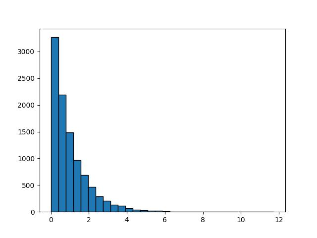
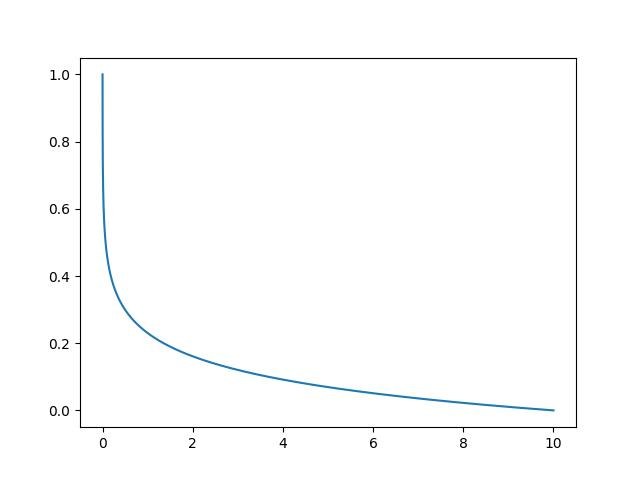

## HW5

#### Q1

(1) $P(X=i,Y=j)=\dfrac{\binom{3}{i}\binom{4}{j}\binom{5}{3-i-j}}{\binom{12}{3}},i+j\leq3$，故分布表为：

| $(X,Y)$  | $(0,0)$           | $(0,1)$           | $(0,2)$           | $(0,3)$          | $(1,0)$           | $(1,1)$           | $(1,2)$           | $(2,0)$           | $(2,1)$           | $(3,0)$          |
| -------- | ----------------- | ----------------- | ----------------- | ---------------- | ----------------- | ----------------- | ----------------- | ----------------- | ----------------- | ---------------- |
| $P(X,Y)$ | $\dfrac{10}{220}$ | $\dfrac{40}{220}$ | $\dfrac{30}{220}$ | $\dfrac{4}{220}$ | $\dfrac{30}{220}$ | $\dfrac{60}{220}$ | $\dfrac{18}{220}$ | $\dfrac{15}{220}$ | $\dfrac{12}{220}$ | $\dfrac{1}{220}$ |

 (2) 由分布表得，$P(X=1)=\dfrac{30}{220}+\dfrac{60}{220}+\dfrac{18}{220}=\dfrac{27}{55}$

####  Q2

证明：根据 CDF 的定义，$F(b,d)-F(a,d)=P(X\leq b, Y\leq d)-P(X\leq a, Y\leq d)=P(a<X\leq b, Y\leq d)$

同理，$F(b,c)-F(a,c)=P(X\leq b, Y\leq c)-P(X\leq a, Y\leq c)=P(a<X\leq b,Y\leq c)$

所以，

$$
\begin{align}
F(b,d)-F(a,d)-F(b,c)+F(a,c)&=(F(b,d)-F(a,d))-(F(b,c)-F(a,c))\\&=P(a<X\leq b,Y\leq d)-P(a<X\leq b, Y\leq c)\\&=P(a<X\leq b,c<Y\leq d)
\end{align}
$$

#### Q3

(1) $(X,Y)$ 的概率密度函数为 

$$
f_{X,Y}(x,y)=\left
\{
\begin{align}
\dfrac{1}{S_{\text{圆}}}=\dfrac{1}{\pi}&,x^2+y^2\leq 1\\
0&,其余
\end{align}
\right.
$$

(2) $X$ 的边际分布的概率密度函数为 $f_X(x)=\int_{-\infty}^{+\infty}f_{X,Y}(x,y)dy=\int_{x^2+y^2\leq 1}\dfrac{dy}{\pi}=\dfrac{2}{\pi}\int_0^{\sqrt{1-x^2}}dy=\dfrac{2\sqrt{1-x^2}}{\pi},0\leq x\leq 1$

同理，$Y$ 的边际分布的概率密度函数为 $f_Y(y)=\dfrac{2\sqrt{1-y^2}}{\pi},0\leq y\leq 1$

(3) $P(R \leq r)=P(x^2+y^2\leq r^2)=\int_{x^2+y^2\leq r^2}{f_{X,Y}(x,y)dxdy}=\dfrac{\pi r^2}{\pi}=r^2$

(4) $R$ 的概率密度函数 $f_R(r)=F^{\\'}(r)=2r$，故 $E(R)=\int_0^1 rf(r)dr=\int_0^12r^2dr=\dfrac{2}{3}$

#### Q4

对于二元正态分布 $(X,Y)\sim N(\mu_1,\mu_2,\sigma_1^2,\sigma_2^2,\rho)$，有

$$
\begin{align}
f(x,y)&=
\dfrac{1}{2\pi \sigma_1\sigma_2}\dfrac{1}{\sqrt{1-\rho^2}}e^{-\frac{1}{2(1-\rho^2)}((\frac{x-\mu_1}{\sigma_1})^2+(\frac{y-\mu_2}{\sigma_2})^2-2\rho\frac{x-\mu_1}{\sigma_1}\frac{y-\mu_2}{\sigma_2})}\\&=
\dfrac{1}{2\pi \sigma_1\sigma_2}\dfrac{1}{\sqrt{1-\rho^2}}e^{-\frac{(x-\mu_1)^2}{2\sigma_1^2}}e^{-\frac{1}{2(1-\rho^2)}(\frac{y-\mu_2}{\sigma_2}-\rho\frac{x-\mu_1}{\sigma_1})^2}\end{align}
$$

换元，令 $t=\frac{y-\mu_2}{\sigma_2}-\rho\frac{x-\mu_1}{\sigma_1}$，则
$$

\begin{align}
f_X(x)&=\int_{-\infty}^{+\infty}f(x,y)dy\\&=\dfrac{1}{2\pi \sigma_1\sigma_2}\dfrac{1}{\sqrt{1-\rho^2}}e^{-\frac{(x-\mu_1)^2}{2\sigma_1^2}}\int_{-\infty}^{+\infty}\sigma_2e^{-\frac{1}{2(1-\rho^2)}t^2}dt\\&=\dfrac{1}{2\pi \sigma_1\sigma_2}\dfrac{1}{\sqrt{1-\rho^2}}e^{-\frac{(x-\mu_1)^2}{2\sigma_1^2}}\sigma_2\sqrt{2\pi (1-\rho^2)}\\&=\dfrac{1}{\sqrt{2\pi}\sigma_1}e^{-\frac{(x-\mu_1)^2}{2\sigma_1^2}}
\end{align}
$$

同理，$f_Y(y)=\dfrac{1}{\sqrt{2\pi}\sigma_2}e^{-\frac{(y-\mu_2)^2}{2\sigma_2^2}}$

#### Q5

对于二元正态分布 $(X,Y)\sim N(\mu_1,\mu_2,\sigma_1^2,\sigma_2^2,\rho)$，有

$$
f_{X|Y}(x|y)=\dfrac{f(x,y)}{f_Y(y)}=\dfrac{\dfrac{1}{2\pi \sigma_1\sigma_2}\dfrac{1}{\sqrt{1-\rho^2}}e^{-\frac{1}{2(1-\rho^2)}((\frac{x-\mu_1}{\sigma_1})^2+(\frac{y-\mu_2}{\sigma_2})^2-2\rho\frac{x-\mu_1}{\sigma_1}\frac{y-\mu_2}{\sigma_2})}}{\dfrac{1}{\sqrt{2\pi}\sigma_2}e^{-\frac{(y-\mu_2)^2}{2\sigma_2^2}}}
=\dfrac{1}{\sqrt{2\pi}\sigma_1}\dfrac{1}{\sqrt{1-\rho^2}}e^{-\frac{1}{2(1-\rho^2)}(\frac{x-\mu_1}{\sigma_1}-\rho\frac{y-\mu_2}{\sigma_2})^2}
$$

同理，$f_{Y|X}(y|x)=\dfrac{1}{\sqrt{2\pi}\sigma_2}\dfrac{1}{\sqrt{1-\rho^2}}e^{-\frac{1}{2(1-\rho^2)}(\frac{y-\mu_2}{\sigma_2}-\rho\frac{x-\mu_1}{\sigma_1})^2}$

#### Q6

(1) $(X,Y)$ 的概率密度函数为 $f(x,y)=\dfrac{1}{S_{\Delta}}=2,x,y\geq 0,x+y\leq 1$.

(2) $Y$ 的边际密度 $f_Y(y)=\int_0^{1-y}f(x,y)dx=2(1-y),0\leq y\leq 1$.

(3) $f_{X|Y}(x|y)=\dfrac{f(x,y)}{f_Y(y)}=\dfrac{2}{2(1-y)}=\dfrac{1}{1-y},0\leq x\leq 1-y$.

#### Q7

(1) 由于随机变量 $X_1,X_2$ 相互独立，所以

$$
P(X_1=x_1)=\dfrac{\lambda_1^{x_1}e^{-\lambda_1}}{x_1!}\\
P(X_1+X_2=n)=\dfrac{(\lambda_1+\lambda_2)^{n}e^{-(\lambda_1+\lambda_2)}}{n!}\\
P(X_1=x_1,X_1+X_2=n)=P(X_1=x_1)P(X_2=n-x_1)=\dfrac{\lambda_1^{x_1}e^{-\lambda_1}}{x_1!}\dfrac{\lambda_2^{n-x_1}e^{-\lambda_2}}{(n-x_1)!}
$$

于是

$$
\begin{align}
P(X_1=x_1|X_1+X_2=n)&=\dfrac{P(X_1=x_1,X_1+X_2=n)}{P(X_1+X_2=n)}\\&=\dfrac{\dfrac{\lambda_1^{x_1}e^{-\lambda_1}}{x_1!}\dfrac{\lambda_2^{n-x_1}e^{-\lambda_2}}{(n-x_1)!}}{\dfrac{(\lambda_1+\lambda_2)^{n}e^{-(\lambda_1+\lambda_2)}}{n!}}\\&=\dfrac{n!}{x_1(n-x_1)!}{(\dfrac{\lambda_1}{\lambda_1+\lambda_2})}^{x_1}{(1-\dfrac{\lambda_1}{\lambda_1+\lambda_2})}^{n-x_1}
\end{align}
$$

因此 $(X_1|X_1+X_2=n)\sim B(n,\dfrac{\lambda_1}{\lambda_1+\lambda_2})$ 

(2) 假设某节课上有**足够多的**若干男生和若干女生，且男生来上课的人数和女生来上课的人数相互独立，那么若已知该课共来了 $n $ 个人，则来的男生的人数呈二项分布。

#### Q8

(1) 记甲、乙到达时间分别为 $X,Y$，则 $X,Y\sim U(1,2)$。

$$
f_{X,Y}(x,y)=\left
\{
\begin{align}
\dfrac{1}{(2-1)(2-1)}=1&,1\leq x,y\leq 2\\
0&,其余
\end{align}
\right.
$$

(2) 根据题意，有

$$
\begin{align}
P(|X-Y|>\dfrac{1}{6})=\iint_{1\leq x,y\leq 2,|x-y|>\frac{1}{6}}f_{X,Y}(x,y)dxdy=\dfrac{25}{36}
\end{align}
$$

#### Q9

(1) 根据定义，有 $H_X(x)=\lim_{y\rightarrow+\infty}H(x,y)=F(x)$，同理，$H_Y(y)=G(y)$。

(2) 由题意得，$F(x)=x,0\leq x\leq 1,G(y)=y,0\leq y \leq 1$，于是分别取 $\alpha=-1,1$，得到两个不同的二元分布

$H_1(x,y)=xy(1-(1-x)(1-y)),H_2(x,y)=xy(1+(1-x)(1-y))$

#### Q10

构造函数 $H(x,y)=C(F(x),G(y))$，则

$$
\lim_{x\rightarrow+\infty}H(x,y)=\lim_{x\rightarrow+\infty}C(F(x),G(y))=C(1,G(y))=G(y)
$$

同理，$\lim_{y\rightarrow+\infty}H(x,y)=F(x)$

#### Q11

当 $X,Y$ 都离散时，

$$
P(X=x_i)=\sum_{j}P(Y=y_j)P(X=x_i|Y=y_j)\\
P(Y=y_j|X=x_i)=\dfrac{P(Y=y_j)P(X=x_i|Y=y_j)}{\sum_{j}P(Y=y_j)P(X=x_i|Y=y_j)}
$$

当 $X$ 离散，$Y$ 连续时，记 $Y$ 在 $X=x_i$ 条件下的条件 PDF 为 $f_{Y|X}(y|x_i)$，则

$$
P(X=x_i)=\int_{-\infty}^{+\infty}f_Y(y)P(X=x_i|Y=y)dy\\
f_{Y|X}(y|x_i)=\dfrac{f_Y(y)P(X=x_i|Y=y)}{\int_{-\infty}^{+\infty}f_Y(y)P(X=x_i|Y=y)dy}
$$

当 $X$ 连续，$Y$ 离散时，记 $Y$ 在 $X=x$ 条件下的条件 PMF 为 $P(Y=y_i|X=x)$，则

$$
f_X(x)=\sum_iP(Y=y_i)f_{X|Y}(x|y_i)\\
P(Y=y_i|X=x)=\dfrac{P(Y=y_i)f_{X|Y}(x|y_i)}{\sum_iP(Y=y_i)f_{X|Y}(x|y_i)}
$$

当 $X,Y$ 都连续时，

$$
f_X(x)=\int_{-\infty}^{+\infty}f_{X|Y}(x|y)f_Y(y)dy\\
f_{Y|X}(y|x)=\frac{f_{X|Y}(x|y)f_Y(y)}{\int_{-\infty}^{+\infty}f_{X|Y}(x|y)f_Y(y)dy}
$$

#### Q12

(1) 由于 $\iint_{x^2+y^2\leq 1}\dfrac{c}{1+x^2+y^2}dxdy=\int_0^{2\pi}\int_0^1\dfrac{c\rho}{1+\rho^2}d\rho d\theta=\pi c\ln2=1$，故 $c=\dfrac{1}{\pi\ln2}$

(2) $f_X(x)=\int_{-\infty}^{+\infty}f(x,y)dy=2\int_{0}^{\sqrt{1-x^2}}\dfrac{c}{1+x^2+y^2}dy=\dfrac{2}{\pi \ln 2\sqrt{1+x^2}}\arctan\dfrac{\sqrt{1-x^2}}{\sqrt{1+x^2}}$

同理，$f_Y(y)=\dfrac{2}{\pi \ln 2\sqrt{1+y^2}}\arctan\dfrac{\sqrt{1-y^2}}{\sqrt{1+y^2}}$

因此，$f_X(x)f_Y(y)\not=f(x,y)$，$X,Y$ 不独立。

#### Q13

(1) 由于 $X,Y$ 独立，我们有 $f(x,y)=f_X(x)f_Y(y)=\dfrac{1}{2\pi}e^{-\frac{x^2+y^2}{2}}$.

$\forall x^2+y^2\leq 1,g(x,y)=\dfrac{1}{2\pi}e^{-\frac{x^2+y^2}{2}}+\dfrac{xy}{100}\geq \dfrac{1}{2\pi}e^{-\frac{1}{2}}-\dfrac{1}{200}>0$，故 $g(x,y)$ 非负

根据对称性，$\iint_{\mathbb{R}^2}g(x,y)dxdy=\iint_{\mathbb{R}^2}f(x,y)dxdy+\iint_{x^2+y^2\leq 1}\dfrac{xy}{100}dxdy=\iint_{\mathbb{R}^2}f(x,y)dxdy=1$

因此，$g(x,y)$ 是一个二维概率密度函数。

(2) 证明：$g_U(x)=\int_{\mathbb{R}}g(x,y)dy=\int_{\mathbb{R}}f(x,y)dy+\int_{x^2+y^2\leq 1}\dfrac{xy}{100}dy=\int_{\mathbb{R}}f(x,y)dy=\dfrac{1}{\sqrt{2\pi}}e^{-\frac{x^2}{2}}$

同理，$g_V(y)=\dfrac{1}{\sqrt{2\pi}}e^{-\frac{y^2}{2}}$，因此 $U,V$ 服从正态分布。

由于 $g(x,y)$ 在 $x^2+y^2=1$ 处不连续，所以 $(U,V)$ 不服从二元正态分布。

#### Q14

绘制直方图的代码如下：

```python
import matplotlib.pyplot as plt
import numpy as np
import random

y = np.random.uniform(0, 1, 10000)
x = - np.log(1 - y_1)

plt.hist(x, bins = 30, edgecolor='black')
plt.show()
```

生成直方图如下所示：



我们继续作出指数分布的概率密度函数图，代码如下：

```python
# In the next cell
y = np.linspace(0, 1, 10000)
x = 10 * np.exp(- 10 * y_2) # Here lambda = 10

plt.plot(x, y)
plt.show()
```

生成函数图像如下所示：



对比可知，两者形状很接近。
