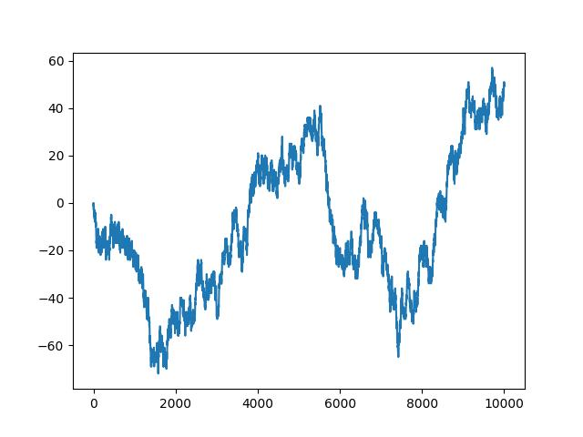
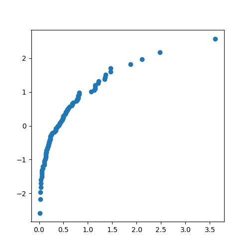

## HW6

#### Q1

由于 $X_1,X_2$ 相互独立，我们有

$$
\begin{align}
P(Y=k)&=P(X_1+X_2=k)\\
&=\sum_{k_1=0}^{k}P(X_1=k_1)P(X_2=k-k_1)\\
&=\sum_{k_1=0}^{k}\dfrac{\lambda_1^{k_1}e^{-\lambda_1}}{k_1!}\dfrac{\lambda_2^{k-k_1}e^{-\lambda_2}}{(k-k_1)!}\\
&=\lambda_2^ke^{-(\lambda_1+\lambda_2)}\sum_{k_1=0}^{k}\dfrac{\left(\dfrac{\lambda_1}{\lambda_2}\right)^{k_1}}{k_1!(k-k_1)!}\\
&=\dfrac{\lambda_2^ke^{-(\lambda_1+\lambda_2)}}{k!}\sum_{k_1=0}^{k}\binom{k}{k_1}\left(\dfrac{\lambda_1}{\lambda_2}\right)^{k_1}\\
&=\dfrac{\lambda_2^ke^{-(\lambda_1+\lambda_2)}}{k!}\left(1+\dfrac{\lambda_1}{\lambda_2}\right)^k\\
&=\dfrac{\left(\lambda_1+\lambda_2\right)^ke^{-(\lambda_1+\lambda_2)}}{k!}
\end{align}
$$

故 $Y\sim P(\lambda_1+\lambda_2)$

设某段时间内，某路口因交通事故造成的男性伤亡数为 $X_1$，女性伤亡数为 $X_2$，总伤亡数为 $Y$，那么 $Y=X_1+X_2$。那么如果 $X_1,X_2$ 分别服从参数为 $\lambda_1,\lambda_2$ 的 poisson 分布，自然，$Y$ 就服从参数为 $\lambda_1+\lambda_2$ 的 poisson 分布。

#### Q2

(1) 令 $Z=\dfrac{Y}{X},X=X$，则 $X=X,Y=ZX$。于是 $J=\det \left[\begin{array}{}1&0\\z&x\end{array}\right]=x$，所以 $(X,Z)$ 的 PDF 为 $f(x,zx)|J|=|x|f(x,zx)$，于是根据独立性和对称性，$Z$ 的概率密度函数为

$$
\begin{align}
f_Z(z)&=\int_{\mathbb{R}}|x|f(x,zx)dx\\
&=2\int_0^{+\infty}xf_X(x)f_Y(zx)dx\\
&=2\int_0^{+\infty}x\dfrac{1}{\sqrt{2\pi}}e^{-\tfrac{1}{2}x^2}\dfrac{1}{\sqrt{2\pi}}e^{-\tfrac{1}{2}(zx)^2}dx\\
&=\dfrac{1}{\pi}\int_0^{+\infty}xe^{-\tfrac{1}{2}(z^2+1)x^2}dx\\
&=\dfrac{1}{\pi}\dfrac{1}{z^2+1}
\end{align}
$$

(2) $J=\det \left[\begin{array}{}\cos\Theta & -R\sin\Theta\\\sin \Theta & R\cos \Theta\end{array}\right]=R$，这里规定 $R\geq0$，则 $(R,\Theta)$ 的概率密度函数

$$
f_{R,\Theta}(r,\theta)=f(r\cos \theta,r\sin \theta)|J|=rf_X(r\cos \theta)f_Y(r\sin \theta)=\dfrac{r}{2\pi}e^{-\tfrac{1}{2}r^2}
$$

于是我们有

$$
f_R(r)=\int_{0}^{2\pi}f_{R,\Theta}(r,\theta)d\theta=re^{-\frac{1}{2}r^2},r\geq0\\
f_\Theta(\theta)=\int_{0}^{+\infty}f_{R,\Theta}(r,\theta)dr=\dfrac{1}{2\pi},0\leq\theta<2\pi
$$

因此，$f_{R,\Theta}(r,\theta)=f_R(r)f_\Theta(\theta)$，所以 $R,\Theta $ 相互独立。

(3) $X=\dfrac{1}{2}(U+V),Y=\dfrac{1}{2}(U-V)$。于是 $J=\det \left[\begin{array}{}\frac{1}{2}&\frac{1}{2}\\\frac{1}{2}&-\frac{1}{2}\end{array}\right]=-\frac{1}{2}$，故 $(U,V)$ 的概率密度函数

$$
f_{U,V}(u,v)=f(\dfrac{1}{2}(u+v),\dfrac{1}{2}(u-v))|J|=\dfrac{1}{2}f_X(\dfrac{1}{2}(u+v))f_Y(\dfrac{1}{2}(u-v))=\dfrac{1}{4\pi}e^{-\tfrac{1}{4}(u^2+v^2)}
$$

于是我们有

$$
f_U(u)=\int_{\mathbb{R}}f_{U,V}(u,v)dv=\dfrac{1}{2\sqrt\pi}e^{-\tfrac{1}{4}u^2}\\
f_V(v)=\int_{\mathbb{R}}f_{U,V}(u,v)du=\dfrac{1}{2\sqrt\pi}e^{-\tfrac{1}{4}v^2}
$$

因此，$f_{U,V}(u,v)=f_U(u)f_V(v)$，所以 $U,V$ 相互独立。

#### Q3

根据独立性，我们有

$$
\begin{align}
F_Y(y)&=P(\max \{X_1,\cdots,X_n\}\leq y)\\&=P(X_1\leq y)\cdots P(X_n\leq y)\\&=F^n(y)\\
F_Z(z)&=P(\min \{X_1,\cdots,X_n\}\leq z)\\&=1-P(\min \{X_1,\cdots,X_n\}> z)\\&=1-P(X_1> y)\cdots P(X_n> z)\\&=1-(1-F(z))^n
\end{align}
$$

#### Q4

1. 卡方分布

   若 $X=\sum_{i=1}^{k}X_i^2$，其中 $X_1,\cdots,X_k$ 相互独立且符合标准正态分布，则称 $X$ 服从自由度为 $k$ 的卡方分布，记作 $X\sim \chi^2(k)$ 或 $X\sim \chi_k^2$

2. t 分布

   设随机变量 $X\sim N(0,1)$，$Y\sim \chi_n^2$，且 $X$ 和 $Y$ 独立，令 $T=\dfrac{X}{\sqrt\frac{Y}{n}}$，则称 $T$ 为自由度为 $n$ 的 t 分布，记作 $T\sim t_n$

3. F 分布

   设随机变量 $X\sim \chi_m^2,Y\sim \chi_n^2$，且 $X$ 和 $Y$ 独立，令 $F=\dfrac{X/m}{Y/n}$，则称 $F$ 为参数为 $m$ 和 $n$ 的 F 分布，记作 $F\sim F(m,n)$

#### Q5

(1) 根据题意，投注站需要确保无论哪匹马赢，都能赚取 $(500+300+200)\times \dfrac{5}{100}=50$ 元。

A 马赔率应设置为 $(1000-500-50):500=0.9$

B 马赔率应设置为 $(1000-300-50):300\approx 2.17$

C 马赔率应设置为 $(1000-200-50):200=3.75$

(2) 获胜概率 $p=\dfrac{1}{1+\text{赔率}}$，于是

A 马获胜概率 $p_A=\dfrac{1}{1+0.9}=\dfrac{10}{19}$

B 马获胜概率 $p_B=\dfrac{1}{1+2.17}=\dfrac{6}{19}$

C 马获胜概率 $p_C=\dfrac{1}{1+3.75}=\dfrac{4}{19}$ 

(3) 3 匹马的隐含获胜概率之和 $\dfrac{20}{19}>1$，因此投注站稳赚不赔。对比 2-14，甲、乙对于支持的队伍获胜的主观概率之和大于1，因此可以同时与之打赌，保证赢钱。

#### Q6

(1) 错误。若 $X\equiv c $，$c$ 为常数，则 $Var(X)=0$，该式显然不成立。

(2) 错误。考虑 $X\sim B(2,\dfrac{1}{3})$，则中位数为 $1$，而 $E(X)=\dfrac{2}{3}$

#### Q7

证明：

$$
\begin{align}
E((X-c)^2)-Var(X)&=E((X-c)^2)-E((X-E(X))^2)\\&=E((X-c)^2-(X-E(X))^2)\\&=E((2E(X)-2c)X+c^2-E^2(X))\\&=(2E(X)-2c)E(X)+c^2-E^2(X)\\&=E^2(X)-2cE(X)+c^2\\&=(E(X)-c)^2\\&\geq 0
\end{align}
$$

所以 $E((X-c)^2)\geq Var(X)$，等号成立当且仅当 $c=E(X)$

#### Q8

证明：当 $c<m$ 时，有

$$
\begin{align}
E(|X-c|)-E(|X-m|)&=E(|X-c|-|X-m|)\\
&=\int_{\mathbb{R}}(|x-c|-|x-m|)f(x)dx\\
&=\int_{-\infty}^m(|x-c|-|x-m|)f(x)dx+\int_{m}^{+\infty}(|x-c|-|x-m|)f(x)dx\\
&\geq (c-m)\int_{-\infty}^mf(x)dx+(m-c)\int_m^{+\infty}f(x)dx\\
&=\dfrac{1}{2}(c-m)+\dfrac{1}{2}(m-c)\\
&=0
\end{align}
$$

当 $c=m$ 时，结论显然成立。

当 $c>m$ 时，有

$$
\begin{align}
E(|X-c|)-E(|X-m|)&=E(|X-c|-|X-m|)\\
&=\int_{\mathbb{R}}(|x-c|-|x-m|)f(x)dx\\
&=\int_{-\infty}^m(|x-c|-|x-m|)f(x)dx+\int_{m}^{+\infty}(|x-c|-|x-m|)f(x)dx\\
&\geq (c-m)\int_{-\infty}^mf(x)dx+(m-c)\int_m^{+\infty}f(x)dx\\
&=\dfrac{1}{2}(c-m)+\dfrac{1}{2}(m-c)\\
&=0
\end{align}
$$

综上，对于任意常数 $c$，不等式 $E(|X-c|)\geq E(|X-m|)$ 成立

#### Q9

设随机变量 $X>0$ 服从对数正态分布，即 $\log X=Y\sim N(\mu,\sigma^2)$，那么

$$
\begin{align}
E(X)&=\int_{0}^{+\infty}xf_X(x)dx\\&=\int_{-\infty}^{+\infty}e^yf_Y(y)dy\\
&=\int_{-\infty}^{+\infty}\dfrac{1}{\sqrt{2\pi}\sigma}e^{y-\tfrac{(y-\mu)^2}{2\sigma^2}}dy\\
&=e^{\tfrac{1}{2}\sigma^2+\mu}\int_{-\infty}^{+\infty}\dfrac{1}{\sqrt{2\pi}\sigma}e^{-\tfrac{(y-\sigma^2-\mu)^2}{2\sigma^2}}dy\\&=e^{\tfrac{1}{2}\sigma^2+\mu}\\
Var(X)&=\int_{0}^{+\infty}x^2f_X(x)dx-E^2(X)\\
&=\int_{-\infty}^{+\infty}e^{2y}f_Y(y)dy-E^2(X)\\
&=\int_{-\infty}^{+\infty}\dfrac{1}{\sqrt{2\pi}\sigma}e^{2y-\tfrac{(y-\mu)^2}{2\sigma^2}}dy-E^2(X)\\
&=e^{2\sigma^2+2\mu}\int_{-\infty}^{+\infty}\dfrac{1}{\sqrt{2\pi}\sigma}e^{-\tfrac{(y-2\sigma^2-\mu)^2}{2\sigma^2}}dy-E^2(X)\\
&=e^{2\sigma^2+2\mu}-e^{\sigma^2+2\mu}\\
&=e^{\sigma^2+2\mu}(e^{\sigma^2}-1)
\end{align}
$$

#### Q10

由于随机变量 $X_i$ 独立同分布，我们有

$$
Var(\overline{X})=Var(\dfrac{1}{n}\sum_{i=1}^{n}X_i)=\dfrac{1}{n^2}\sum_{i=1}^{n}Var(X_i)=\dfrac{\sigma^2}{n}\\
E(S^2)=\dfrac{1}{n-1}E(\sum_{i=1}^n(X_i-\overline{X})^2)=\dfrac{1}{n-1}(\sum_{i=1}^nE(X_i^2)-nE(\overline{X}^2))=\dfrac{1}{n-1}(n(\sigma^2+\mu^2)-n(\dfrac{\sigma^2}{n}+\mu^2))=\sigma^2
$$

#### Q11

四者等价，证明如下：

(1) $\Rightarrow$ (2)：若 $Cov(X,Y)=0$，则 $Corr(X,Y)=\dfrac{Cov(X,Y)}{\sigma_1\sigma_2}=0$，故 $X,Y$ 不相关。

(2) $\Rightarrow$ (3)：若 $X,Y$ 不相关，则 $Corr(X,Y)=\dfrac{Cov(X,Y)}{\sigma_1\sigma_2}=0$，于是 $Cov(X,Y)=0$，又 $Cov(X,Y)=E(XY)-E(X)E(Y)$，所以 $E(XY)=E(X)E(Y)$。

(3) $\Rightarrow$ (4)：若 $E(XY)=E(X)E(Y)$，则 $E((X-E(X))(Y-E(Y)))=E(XY)-E(X)E(Y)=0$，所以 $Var(X+Y)=Var(X)+Var(Y)-E((X-E(X))(Y-E(Y)))=Var(X)+Var(Y)$。

(4) $\Rightarrow$ (1)：若 $Var(X+Y)=Var(X)+Var(Y)$，根据 $Var(X+Y)=Var(X)+Var(Y)-E((X-E(X))(Y-E(Y)))$，得 $Cov(X,Y)=E((X-E(X))(Y-E(Y)))=0$。

#### Q12

证明：若 $(X,Y)\sim N(\mu_1,\mu_2,\sigma_1,\sigma_2,\rho)$，则

$$
Corr(X,Y)=E(\dfrac{X-\mu_1}{\sigma_1}\dfrac{Y-\mu_2}{\sigma_2})=\iint_{\mathbb{R}^2}\dfrac{x-\mu_1}{\sigma_1}\dfrac{y-\mu_2}{\sigma_2}f(x,y)dxdy
$$

令 $s=\dfrac{x-\mu_1}{\sigma_1},t=\dfrac{x-\mu_2}{\sigma_2}$，则

$$
\begin{align}
Corr(X,Y)&=\iint_{\mathbb{R}^2}\dfrac{1}{2\pi}\dfrac{1}{\sqrt{1-\rho^2}}e^{-\tfrac{1}{2(1-\rho^2)}(s^2+t^2-2\rho st)}st\ dsdt\\
&=\dfrac{1}{2\pi}\dfrac{1}{\sqrt{1-\rho^2}}\iint_{\mathbb{R}^2}ste^{-\tfrac{1}{2(1-\rho^2)}(s^2+t^2-2\rho st)}dsdt\\
&=\dfrac{1}{2\pi}\dfrac{1}{\sqrt{1-\rho^2}}(2\pi\rho\sqrt{1-\rho^2})\\&=\rho
\end{align}
$$

#### Q13

设 $X_i$ 为第 $i$ 个人是否拿到自己的帽子的随机变量，则 $P(X_i=1)=\dfrac{1}{n},P(X_i=0)=1-\dfrac{1}{n}$，且 $X=\sum_{i=1}^{n}X_i$，于是

$$
E(X)=\sum_{i=1}^{n}E(X_i)=\sum_{i=1}^{n}\dfrac{1}{n}=1
$$

而对于任意 $i\not=j$，$P(X_i=1,X_j=1)=P(X_i=1)P(X_j=1|X_i=1)=\dfrac{1}{n}\dfrac{1}{n-1}$，所以 $E(X_iX_j)=\dfrac{1}{n(n-1)}$，所以 $Cov(X_i,X_j)=E(X_iX_j)-E(X_i)E(X_j)=\dfrac{1}{n(n-1)}-\dfrac{1}{n^2}=\dfrac{1}{n^2(n-1)}$，故

$$
Var(X)=Var(\sum_{i=1}^{n}X_i)=\sum_{i=1}^{n}Var(X_i)+2\sum_{i\not=j}Cov(X_i,X_j)=n(\dfrac{1}{n}-\dfrac{1}{n^2})+n(n-1)\dfrac{1}{n^2(n-1)}=1
$$

#### Q14

(1) 证明：$\forall t\in \mathbb{R},E\left[(U-tV)^2\right]=E(U^2)-2tE(UV)+t^2E(V^2)\geq0$，这是关于 $t$ 的二次函数，因此根的判别式 $\Delta=4E^2(UV)-4E(V^2)E(U^2)\leq 0$，即 $E^2(UV)\leq E(U^2)E(V^2)$。等号成立当且仅当 $E\left[(U-tV)^2\right]=0$，而 $(U-tV)^2\geq 0$，所以 $\exist c\in \mathbb{R},P(V=cU)=1$。

(2) 证明：

$$
|Corr(X,Y)|=\dfrac{1}{\sigma_1\sigma_2}|E((X-\mu_1)(Y-\mu_2))|\leq \dfrac{1}{\sigma_1\sigma_2}\sqrt{E\left[(X-\mu_1)^2\right]E\left[(Y-\mu_2)^2\right]}={\sigma_1\sigma_2}\sqrt{\sigma_1^2\sigma_2^2}=1
$$

等号成立当且仅当存在常数 $c$，使得 $P(X-\mu_1=c(Y-\mu_2))$，即存在 $a,b$，使得 $P(Y=aX+b)=1$。

#### Q15

(1) 证明：因为 $X_i$ 独立同分布，所以

$$
\begin{align}
Cov(X_i-\overline{X},\overline{X})
&=E((X_i-\overline{X})\overline{X})-E(X_i-\overline{X})E(\overline{X})\\
&=E(X_i\overline{X})-E(\overline{X}^2)\\
&=\dfrac{1}{n}\sum_{k=1}^{n}E(X_iX_k)-(Var(\overline{X})+E^2(\overline{X}))\\
&=\dfrac{1}{n}((n-1)\mu^2+\sigma^2+\mu^2)-(\dfrac{\sigma^2}{n}+\mu^2)\\
&=0
\end{align}
$$

(2) 不一定。假设 $X_i\sim B(\dfrac{1}{2})$，则 $P(X_i-\overline{X}=0,\overline{X}=1)=\left(\dfrac{1}{2}\right)^n$，而 $P(X_i-\overline{X}=0)P(\overline{X}=1)=2\times\left(\dfrac{1}{2}\right)^n\times\left(\dfrac{1}{2}\right)^n=\left(\dfrac{1}{2}\right)^{2n-1}$，两者不相等，故 $X_i-\overline{X}$ 与 $\overline{X}$ 不一定独立。

#### Q16

(1) 代码如下：

```python
from scipy.stats import norm
import matplotlib.pyplot as plt
import numpy as np

n = 100

random_nums = np.random.normal(size = n)
random_nums.sort()

quantiles = np.linspace(0.5/n, 1 - 0.5/n, n)
std_quantiles = norm.ppf(quantiles)

plt.figure(figsize=(8, 8))
plt.scatter(random_nums, std_quantiles)
plt.show()
```

生成的 Q-Q 图如下所示：



可见其近似为一条直线。

(2) 代码如下：

```python
# in the next cell
exp_nums = np.random.exponential(1/2, 100)
exp_nums.sort()

plt.figure(figsize=(8, 8))
plt.scatter(exp_nums, std_quantiles)
plt.show()
```

生成的 Q-Q 图如下所示：



(3) 可以。将纵坐标修改为该数据值相应于**假设的分布**的分位数，看看绘得 Q-Q 图是否近似为一条直线。

(4) 可以。将横、纵坐标分别作为两个数据集所对应的观测分位数，看看绘得 Q-Q 图是否近似为一条直线。
