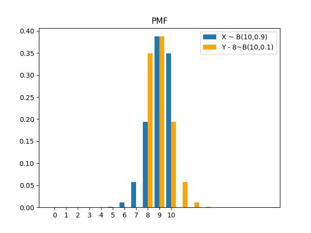
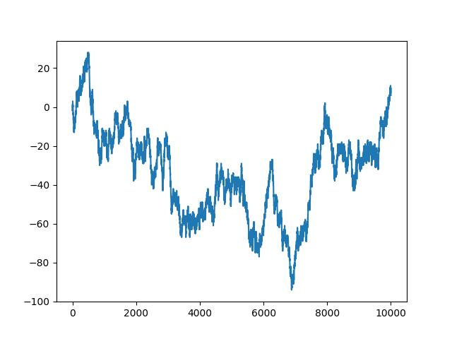
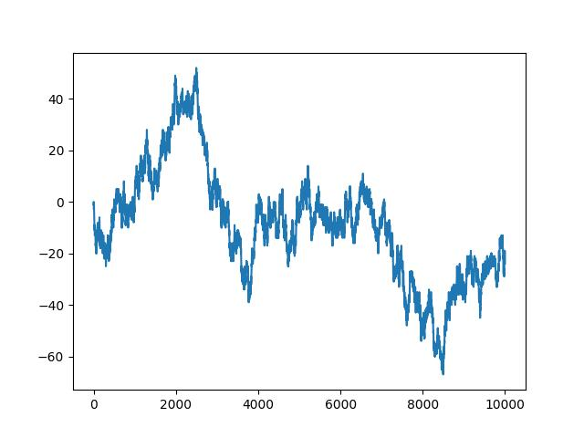
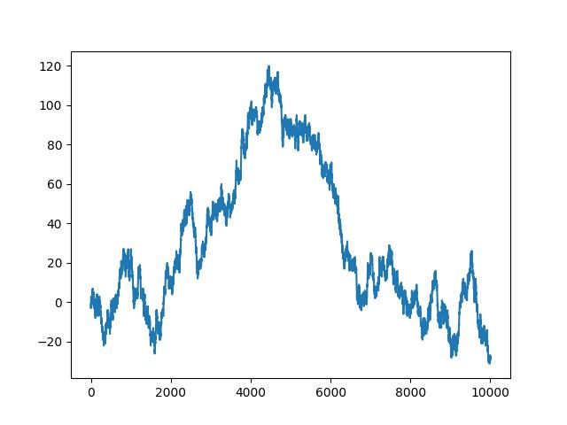

## HW7

#### Q1

(1) 概率质量函数图如下所示：



(2) $E(X)=9,E(Y)=9$

$Var(X)=0.9,Vay(Y)=0.9$

$X$ 的中位数是 $9$，$Y$ 的中位数是 $9$

$X$ 的众数是 $9$，$Y$ 的众数是 $9$

(3) $X$ 的偏度系数 $Skew(X)=\dfrac{E((X-9)^3)}{0.9^{\frac 3 2}}=\dfrac{\sum_{k=0}^{10}(k-9)^3	P(X=k)}{0.9^{\frac 3 2}}=-\dfrac {0.8}{\sqrt {0.9}}=-\dfrac {4\sqrt{10}}{15}$

设 $Z=Y-8$，则 $Skew(Y)=Skew(Z)=\dfrac{\sum_{k=0}^{10}(k-1)^3P(Z=k)}{0.9^{\frac 3 2}}=\dfrac {0.8}{\sqrt {0.9}}=\dfrac {4\sqrt{10}}{15}$

#### Q2

(1) 记 $X\sim Exp(1)$ ，则 $E(X)=4,Var(X)=1$
$$
Skew(X)=E((X-1)^3)=\int_0^{+\infty}(x-1)^3e^{-x}dx=-(x^2+3x+2)e^{-x}\bigg|_0^{+\infty}=2\\
Kurt(X)=E((X-1)^4)=\int_0^{+\infty}(x-1)^4e^{-x}dx=-(x^4+6x^2+8x+9)e^{-x}\bigg|_0^{+\infty}=9
$$

记 $Y\sim P(4)$，则 $E(Y)=4,Var(Y)=4$

$$
Skew(Y)=\frac1 8 E((Y-4)^3)=\frac1 8\sum_{k=0}^{+\infty}(k-4)^3\dfrac{4^ke^{-4}}{k!}=\frac1 2  \\
Kurt(Y)=\frac1 {16} E((Y-4)^4)=\frac1 {16}\sum_{k=0}^{+\infty}(k-4)^4\dfrac{4^ke^{-4}}{k!}=\frac{13}4
$$

记 $Z\sim U(0,1)$ ，则 $E(Z)=\dfrac 1 2,Var(Z)=\dfrac1 {12}$
$$
Skew(Z)=\dfrac {E((Z-\frac1 2)^3)}{\left(\frac1{12}\right)^{\frac3 2}}=12^{\frac3 2}\int_0^1(z-\frac1 2)^3dz=0\\
Kurt(Z)=\dfrac{E((Z-\frac1 2)^4)}{\left(\frac1{12}\right)^2}=144\int_0^1(z-\frac1 2)^4dz=\frac9 5
$$

(2) 矩母函数
$$
M_X(t)=\int_0^{+\infty}e^{tx}e^{-x}dx=\frac1 {1-t},t<1\\
M_Y(t)=E(e^{tY})=\sum_{k=0}^{+\infty}e^{tk}\frac{4^ke^{-4}}{k!}=e^{4(e^t-1)}\\
M_Z(t)=\int_0^1e^{tz}dz=\frac{e^t -1}t
$$
(3) 对于任意连续随机变量 $X$，$M_X(t)=\int_{\mathbb{R}}e^{tx}f(x)dx$，于是 $M_X^{(k)}(t)=\int_{\mathbb{R}}x^ke^{tx}f(x)dx$，故 $M_X^{(k)}(0)=\int_{\mathbb{R}}x^kf(x)dx=E(x^k)$
$$
Var(X)=\int_{\mathbb{R}}(X-E(X))^2 f(x)dx=M_X^{(2)}(0)-(M_X^{(1)}(0))^2\\
Skew(X)=\dfrac{E((X-\mu)^3)}{\sigma ^ 3}=\dfrac {M_X^{(3)}(0)-3M_X^{(1)}(0)M_X^{(2)}(0)+2(M_X^{(1)}(0))^3} {(M_X^{(2)}(0)-(M_X^{(1)}(0))^2)^{\frac 3 2}}\\
Kurt(X)=\dfrac{E((X-\mu)^4)}{\sigma ^ 4}=\dfrac {M_X^{(4)}(0)-4M_X^{(1)}(0)M_X^{(3)}(0)+6(M_X^{(1)}(0))^2M_X^{(2)}(0)-3(M_X^{(1)}(0))^4} {(M_X^{(2)}(0)-(M_X^{(1)}(0))^2)^2}
$$
类似地，当 $X$ 为离散随机变量时，上述结论仍成立，于是
$$
Skew(X)=\dfrac{6-3\times1\times2+2\times1^3}{(2-1)^{\frac32}}=2\\
Kurt(X)=\dfrac{24-4\times1\times6+6\times1^2\times2-3\times1^4}{(2-1)^2}=9\\
Skew(Y)=\dfrac{116-3\times4\times20+2\times4^3}{(2-1)^{\frac32}}=\frac1 2\\
Kurt(Y)=\dfrac{756-4\times4\times116+6\times4^2\times20-3\times4^4}{(20-4^2)^2}=\frac{13}4\\
Skew(Z)=\dfrac{\frac14-3\times\frac12\times\frac13+2\times(\frac12)^3}{(\frac13-\frac14)^{\frac32}}=0\\
Kurt(Z)=\dfrac{\frac15-4\times\frac12\times\frac14+6\times(\frac12)^2\times\frac13-3\times(\frac12)^4}{(\frac13-\frac14)^2}=\frac95\\
$$

#### Q3

通过观察，$X$ 应为两个指数分布 $X_1,X_2$ 的线性组合，即 $X=\dfrac13X_1+\dfrac23X_2$，其中 $X_1\sim Exp(2)，X_2\sim Exp(3)$，且 $f(x)=\dfrac13(2e^{-2x})+\dfrac23(3e^{-3x})$。下面给出证明：

首先，$\int_0^{+\infty}f(x)dx=\frac13\int_0^{+\infty}f_{X_1}(x_1)dx_1+\frac23\int_0^{+\infty}f_{X_2}(x_2)dx_2=\frac13+\frac23=1$，所以 $f(x)$ 是概率密度函数。于是我们有
$$
\begin{align}
M_X(t)&=\int_0^{+\infty}e^{tx}\left[\dfrac13(2e^{-2x})+\dfrac23(3e^{-3x})\right]dx\\
&=\frac13\int_0^{+\infty}e^{tx_1}f_{X_1}(x_1)dx_1+\frac23\int_0^{+\infty}e^{tx_2}f_{X_2}(x_2)dx_2\\
&=\frac13M_{X_1}(t)+\frac23M_{X_2}(t)\\
&=\frac13\times\frac2{2-t}+\frac23\times\frac3{3-t}
\end{align}
$$
因此，$X$ 的概率密度函数为 $f(x)=\dfrac23e^{-2x}+2e^{-3x}$

#### Q4

(1) 证明：当 $t>0$ 时，
$$
\lim_{y\rightarrow+\infty}M_Y(t)=\lim_{y\rightarrow+\infty}e^{ty}f_Y(y)=+\infty
$$
积分发散，因此对数正态分布的矩母函数不存在。

(2) 对于 $X\sim N(\mu, \sigma^2)$，$M_X(t)=e^{\tfrac{\sigma^2t^2}2+\mu t}$，故 $Y$ 的 $n$ 阶原点矩 $E(Y^n)=E(e^{nX})=M_X(n)=e^{\tfrac{\sigma^2 n^2}2+\mu n}$

#### Q5

由于 $X_1,X_2$ 相互独立，有
$$
M_Y(t)=M_{X_1}(t)M_{X_2}(t)=e^{\lambda_1(e^t-1)}e^{\lambda_2(e^t-1)}=e^{(\lambda_1+\lambda_2)(e^t-1)}
$$
因此 $Y\sim P(\lambda_1+\lambda_2)$

#### Q6

记第 1 次断开后前半段长度为 $X$，第 2 次断开后前半段长度为 $Y$，则 $X\sim U(0,1)$，于是 $E(X)=\dfrac12$，$E(Y|x)=\dfrac12(1-x)$

所以 $E(Y)=E(E(Y|x))=E(\dfrac12(1-x))=\dfrac14$

所以 $E(1-X-Y)=1-E(X)-E(Y)=1-\dfrac12-\dfrac14=\dfrac14$

#### Q7

记走到安全之处的用时为随机变量 $X$，第 1 次选第 $Y$ 个门，根据条件期望公式，有
$$
E(X|Y=1)=2\\ E(X|Y=2)=3+E(X) \\ E(X|Y=3)=1+E(X)
$$
于是 $E(X)=\sum_{y=1}^3E(X|Y=y)P(Y=y)=\dfrac13(6+2E(X))$，解得 $E(X)=6$

#### Q8

证明：若 $E(Y|X)=X$，则 $E(XY)=E(E(XY|X))=E(XE(Y|X))=E(X^2)$，$E(Y)=E(E(Y|X))=E(X)$

故 $Cov(X,Y)=E(XY)-E(X)E(Y)=E(X^2)-E^2(X)=Var(X)$

#### Q9

(1) 证明：由于 $X,Y$ 独立，所以当 $Y$ 离散、连续时，分别有
$$
E(Y|X)=\sum_iy_iP(Y=y_i|X=x)=\sum_iy_iP(Y=y_i)=E(Y)\\
E(Y|X)=\int_{\mathbb R}yf_{Y|X}(y|x)dy=\int_{\mathbb R}yf_Y(y)dy=E(Y)
$$
(2) 反之不一定成立。例如抛一枚硬币，记正面朝上的次数为 $X$，令 $Y=X$，则 $E(Y|X)=E(Y)=\dfrac12$，然而，$X,Y$ 不独立。

#### Q10

证明：
$$
\begin{align}
Var(Y)&=E(Y^2)-E^2(Y)\\
&=E(\widetilde Y^2+2\widetilde Y\hat Y+\hat Y^2)-E^2(Y)\\
&=E(\widetilde Y^2)+E(2\widetilde Y\hat Y)+E(\hat Y^2)-E^2(Y)\\
&=E(\widetilde Y^2)+E(\hat Y^2)-E^2(Y)\\
&=(E(\widetilde Y^2)-E^2(\widetilde Y)) + (E(\hat Y^2)-E^2(\hat Y))\\
&=Var(\widetilde Y)+Var(\hat Y)
\end{align}
$$
作为 $Y$ 的最优估计，$\widetilde Y$ 相比 $Y$ 更为集中，缩小了 $Y$ 的方差。但要想弥补这些差距，还需加上估计误差对应的方差。

#### Q11

(1) 证明：

$$
\begin{align}
Var(Y|X)&=E[(Y-E(Y|X))^2|X]\\
&=E[Y^2-2YE(Y|X)+E^2(Y|X)|X]\\
&=E(Y^2|X)-2E(YE(Y|X)|X)+E^2(Y|X)\\
&=E(Y^2|X)-2E^2(Y|X)+E^2(Y|X)\\
&=E(Y^2|X)-E^2(Y|X)
\end{align}
$$
(2) 证明：
$$
\begin{align}
Var(Y)&=E(Y^2)-E^2(Y)\\
&=[E(Y^2)-E(E^2(Y|X))]+[E(E^2(Y|X))-E^2(Y)]\\
&=E[E(Y^2|X)-E^2(Y|X)]+[E(E^2(Y|X))-E^2(E(Y|X))]\\
&=E[Var(Y|X)]+Var[E(Y|X)]
\end{align}
$$

#### Q12

根据题意，$f(x,y)=\dfrac2 \pi,(x^2+y^2\leq 1\text{且}y\geq0)$，所以 $f_X(x)=\int_0^{\sqrt{1-x^2}}f(x,y)dy=\dfrac2 \pi\sqrt{1-x^2}$

故 $f_{Y|X}(y|x)=\dfrac{f(x,y)}{f_X(x)}=\dfrac1{\sqrt{1-x^2}}$

于是 $E(Y|X=x)=\int_{\mathbb R}yf_{Y|X}(y|x)dy=\int_0^{\sqrt{1-x^2}}\dfrac y{\sqrt{1-x^2}}dy=\dfrac{\sqrt{1-x^2}}2$

代入 $X=0.5$，得 $E(Y|X=0.5)=\dfrac{\sqrt3}4$

#### Q13

(1) 根据题意，有
$$
\begin{align}
E[(Y-(aX+b)^2)]&=E(Y^2)-2aE(XY)+a^2E(X^2)+2abE(X)-2bE(Y)+b^2\\
&=(\mu_2^2+\sigma_2^2)-2a(\mu_1\mu_2+\rho\sigma_1\sigma_2)+a^2(\mu_1^2+\sigma_1^2)+2ab\mu_1-2b\mu_2+b^2\\
&=(\mu_1^2+\sigma_1^2)a^2+2\mu_1ab+b^2-2(\mu_1\mu_2+\rho\sigma_1\sigma_2)a-2\mu_2b+\mu_2^2+\sigma_2^2
\end{align}
$$
令 $g(a,b)=(\mu_1^2+\sigma_1^2)a^2+2\mu_1ab+b^2-2(\mu_1\mu_2+\rho\sigma_1\sigma_2)a-2\mu_2b+\mu_2^2+\sigma_2^2$

令 $\left\{
\begin{align}
\dfrac{\partial g}{\partial a}&=2[(\mu_1^2+\sigma_1^2)a+\mu_1b-(\mu_1\mu_2+\rho\sigma_1\sigma_2)]=0\\
\dfrac{\partial g}{\partial b}&=2(\mu_1a+b-\mu_2)=0
\end{align}
\right.$，解得当 $\left\{
\begin{align}
a&=\rho \dfrac {\sigma_2}{\sigma_1}\\
b&=\mu_2-\rho \mu_1 \dfrac {\sigma_2}{\sigma_1}
\end{align}
\right.$ 时，$E[(Y-(aX+b)^2)]$ 达到极小值。

(2) 将 (1) 中的 $a,b$ 代入原式，得均方误差 $E[(Y-(aX+b)^2)]=\sigma_2^2(1-\rho^2)$，当 $\sigma_2^2\rightarrow 0$ 或 $\rho\rightarrow 1$，该值接近 0。

(3) 
$$
\begin{align}
E(Y|x)&=\int_{\mathbb R}yf_{Y|X}(y|x)dy=\mu_2+\rho\dfrac {\sigma_2}{\sigma_1}(x-\mu_1)\\
E(Y|X)&=\mu_2+\rho\dfrac {\sigma_2}{\sigma_1}(X-\mu_1)
\end{align}
$$
而 $Y$ 的最优线性预测 $\hat Y=aX+b=\rho\dfrac {\sigma_2}{\sigma_1}X+\mu_2-\rho\mu_1\dfrac {\sigma_2}{\sigma_1}=\mu_2+\rho\dfrac {\sigma_2}{\sigma_1}(X-\mu_1)$，刚好为 $E(Y|X)$。

#### Q14

(1)
$$
\begin{align}
E(Y|n)&=E(X_1)+E(X_2)+\cdots+E(X_n)=\mu n\\
E(Y|N)&=\mu N\\
E(Y)&=E(E(Y|N))=E(\mu N)=\mu a
\end{align}
$$
(2)
$$
M_N(t)=E(e^{tN})=\sum_{n=1}^{+\infty}e^{tn}P(N=n)=\sum_{n=1}^{+\infty}e^{tn}p_n
$$
(3)
$$
M_Y(t)=E(e^{tY})=E(E(e^{tY}|N))=E(M_X^N(t))=\sum_{n=1}^{+\infty}M_X^n(t)p_n
$$
(4) 因为 $X_i\sim Exp(\lambda)$，所以 $M_X(t)=\dfrac{\lambda}{\lambda-t}$

由 (2) (3) 可知 $M_Y(t)=\sum_{n=1}^{+\infty}M_X^n(t)p_n$，$M_N(t)=\sum_{n=1}^{+\infty}e^{tn}(1-p)^{n-1}p=\dfrac{pe^t}{1-(1-p)e^t}$

将 $M_N(t)$ 中的 $e^t$ 换成 $\dfrac{\lambda}{\lambda-t}$，得 $M_Y(t)=\dfrac{p\dfrac{\lambda}{\lambda-t}}{1-(1-p)\dfrac{\lambda}{\lambda-t}}=\dfrac{p\lambda}{p\lambda-t}$

所以 $Y\sim Exp(p\lambda)$

(5) $M_{X_1+X_2}(t)=M_X^2(t)=\left(\dfrac{\lambda}{\lambda-t}\right)^2\ne M_Y(t)$，因此不相同。

#### Q15

记 $X_i\sim N(0,1)(i=1,2\cdots)$ 独立同分布，$Y\sim X_1+\cdots X_N$，$N$ 服从参数为 $p$ 的几何分布，且与 $X_i(i=1,2\cdots)$ 相互独立。

那么类似上一题，可得 $M_N(t)=\dfrac{pe^t}{1-(1-p)e^t}$，$M_X(t)=e^{\tfrac{t^2}2}$，$t\in \mathbb R$

将 $M_N(t)$ 中的 $e^t$ 换成 $e^{\tfrac{t^2}2}$，可得 $M_Y(t)=\dfrac{pe^{\tfrac{t^2}2}}{1-(1-p)e^{\tfrac{t^2}2}}$，显然 $Y$ 不符合正态分布。

#### Q16

(1) 由于 $Y_i$ 独立同分布，所以 $E(X_n)=\sum_{i=1}^nE(Y_i)=0,Var(X_n)=\sum_{i=1}^nVar(Y_i)=n$

(2) 代码如下：

```python
import matplotlib.pyplot as plt
import numpy as np

def simulate_stock_market(n):
    results = []
    Y = 2 * np.random.randint(0, 2, size = n) - 1 
    X_n = np.cumsum(Y)
    results.append(X_n)
    return results

def plot_results(results, n):
    fig, ax = plt.subplots()
    for i, result in enumerate(results):
        if i == 0:
            label_str = 'Simulation'
        else:
            label_str = '_no_legend_'
        ax.plot(result, label=label_str)
    plt.show()

n = 10000
results = simulate_stock_market(n)
plot_results(results, n)
```

重复模拟几次后，生成的图像如下所示：







随机序列随着 $n$ 的增大，基本会接近 $0$。图形有差别，但联系 (1) 中的结论，不难发现，纵向对比每个 $n$ 值对应的 $X_n$，它们的均值接近于 $0$，但随着 $n$ 的增大，$Var(X_n)=n$ 也会增大，因此 $n$ 越大，上述几次模拟得到的 $X_n$ 波动越明显。