## HW8

#### Q1

不正确。强大数定理是指 $P(\lim_\limits{n \to +\infty}\dfrac mn=P(A))=1$，它是 $\lim_\limits{n \to +\infty}\dfrac mn=P(A)$ 的必要不充分条件。

#### Q2

证明：记 $Y=\dfrac1n\sum_{i=1}^n(x_i-\mu_i)$，则 $E(Y)=\dfrac1n\sum_{i=1}^n(E(X_i)-\mu_i)=0$，$Var(Y)=\dfrac1{n^2}\sum_{i=1}^n\sigma_i^2$

由 Chebyshev 不等式，有 $P(|Y-E(Y)|\geq\epsilon)\leq\dfrac{Var(Y)}{\epsilon^2}$

所以 $P(|\dfrac1n\sum_{i=1}^nX_i-\dfrac1n\sum_{i=1}^n\mu_i|\geq\epsilon)\leq\dfrac{\sum_{i=1}^n\sigma_i^2}{n^2\epsilon^2}\lt \dfrac c{n\epsilon^2}$

由夹逼原理，$\lim_\limits{n\to+\infty}P(|\dfrac1n\sum_{i=1}^nX_i-\dfrac1n\sum_{i=1}^n\mu_i|\geq\epsilon)=0$

#### Q3

证明：记 $\Phi_n(x)=P(\dfrac{\bar x-\mu}{\sigma/\sqrt n}<x)$，则根据中心极限定理，$\lim_\limits{n\to+\infty}\Phi_n(x)=\Phi(x)$

所以 $\forall\delta\gt0,\exist N\gt0,x\in\mathbb R$，当 $n\gt N$ 时，$\left|\Phi_n(x)-\Phi(x)\right|\lt\delta$

取 $N_1=\left|\left(\dfrac{\sigma x}\epsilon \right)^2\right|+2$，则 $n>\max\{N,N_1\}$ 时，有

$P(|\bar X-\mu|\ge\epsilon)\le1-\Phi_n(\dfrac{\epsilon\sqrt n}{\sigma})+\Phi_n(-\dfrac{\epsilon\sqrt n}{\sigma})\le1-\Phi_n(x)+\Phi_n(-x)\le4\delta$

所以 $\forall\epsilon\gt0,\lim_\limits{n\to+\infty}P(|\bar X-\mu|\ge\epsilon)=0$

#### Q4

证明：$E(S_n^2)=\dfrac1{n-1}E(\sum_{i=1}^n(X_i-X)^2)=\dfrac1{n-1}(\sum_{i=1}^nE(X_i^2)-nE(\bar X^2))=\dfrac1{n-1}(n(\sigma^2+\mu^2)-n(\dfrac{\sigma^2}{n}+\mu^2))=\sigma^2$

根据 Khinchin 弱大数定律，$\forall\epsilon\gt0,\lim_\limits{n\to+\infty}P(|S_n^2-\sigma^2|\lt\epsilon)=1$，所以 $S^2$ 依概率收敛至 $\sigma^2$

#### Q5

证明：定义事件 $A=\{X_n\text{不收敛于}a\}$，$B=\{Y_n\text{不收敛于}b\}$，$C=\{\dfrac {X_n}{Y_n}\text{不收敛于}\dfrac ab\}$

则根据题意可知，$A,B$ 独立，$P(A)=P(B)=0$，因此 $P(A^cB^c)=P(A^c)P(B^c)=1$

由全概率公式得，$P(C)=P(A^cB^c)P(C|A^cB^c)+P((A^cB^c)^c)P(C|(A^cB^c)^c)=1\times0+0\times P(C|(A^cB^c)^c)=0$

因此 $P(\bar C)=0$，即 $\dfrac{X_n}{Y_n}$ 以概率 1 收敛于 $\dfrac ab$

#### Q6

证明：记 $\bar X_n=\dfrac 1n(X_1+\cdots+X_n)$，$\bar Y_n=\dfrac 1n(Y_1+\cdots+Y_n)$，根据 Kolmogorov 强大数定律，$\bar X_n$ 以概率 1 收敛至 2，$\bar Y_n$ 以概率 1 收敛至 5。因此，由上一题的结论可知，$\dfrac{X_1+\cdots X_n}{Y_1+\cdots Y_n}=\dfrac{X_n}{Y_n}$ 以概率 1 收敛至 $\dfrac25$。

#### Q7

根据题意，$X\sim B(40,\dfrac12)$，所以 $P(X=20)=\dbinom{40}{20}\left(\dfrac12\right)^{40}\approx0.1254$

若将其近似为正态分布，则 $y_1=\dfrac{20-20-\dfrac12}{\sqrt{40\times\dfrac12\times\dfrac12}}=-\dfrac{\sqrt{10}}{20},y_2=\dfrac{\sqrt{10}}{20}$，则 $P_N(X=20)=\Phi(y_2)-\Phi(y_1)\approx0.1256$

#### Q8

(1) 记发生事故数为 $Y$，则 $Y\sim B(10000,0.001)$，保险公司不亏损当且仅当 $20000\ge1000Y$，即 $Y\leq 20$

由于 $n=10000$ 足够大，可将 $Y$ 近似为正态分布，于是 $P(Y\le20)\approx\Phi(\dfrac{20-10+\dfrac12}{\sqrt{9.99}})=\Phi(\dfrac{10.5}{\sqrt{9.99}})=0.9996$，获利是大概率事件，合理。

(2) 至少 $20\%$ 毛利润当且仅当 $\dfrac{20000-1000Y}{20000}\ge20\%$，即 $Y\le 16$，所以 $P(Y\le16)\approx\Phi(\dfrac{16-10+\dfrac12}{\sqrt{9.99}})=\Phi(\dfrac{6.5}{\sqrt{9.99}})\approx0.9801$

(3) $P(20000-1000Y\ge x)=P(Y\le 20-0.001x)\approx\Phi(\dfrac{10.5-0.001x}{\sqrt{9.99}})=0.95$，解得 $X\approx 5301$

#### Q9

(1) 记随机误差 $X_i\sim U(-1,1),(i=1,2,\cdots,n)$，令 $\bar X_n = \dfrac1n(X_1+X_2+\cdots+X_n)$

则 $P(|\bar X_n|\lt \epsilon)=P(-n\epsilon\lt\sum_{i=1}^nX_i\lt n\epsilon)\approx\Phi(\sqrt{3n}\epsilon)-\Phi(-\sqrt{3n}\epsilon)=2\Phi(\sqrt{3n}\epsilon)-1$

$n=25,\epsilon=0.2$ 时，近似值为 $2\Phi(\sqrt{3})-1\approx0.9167$

(2) $2\Phi(\sqrt{3n}\epsilon)-1\gt1-\alpha$，由此可解得 $n$ 的最小值。令 $\epsilon=0.2,\alpha=0.05$，解得 $n\ge33$，故至少进行 33 次测量。

(3) 根据 Chebyshev 不等式，$P(|X_n|\lt\epsilon)=1-P(|X_n|\ge\epsilon)\ge1-\dfrac{Var(\bar X_n)}{\epsilon^2}=1-\dfrac1{3n\epsilon^2}\ge1-\alpha$

代入 $\epsilon=0.2,\alpha=0.05$，解得 $n\ge\dfrac1{3\alpha\epsilon^2}=\dfrac{500}3$，故至少进行 $167$ 次测量。

#### Q10

记买到的元件中合格产品数为 $X$，则 $X\sim B(5000,0.8),E(X)=4000,Var(X)=800$

则 $P(\left|\dfrac{X}{5000}-0.8\right|\le\epsilon)=P(\left|\dfrac{X-4000}{\sqrt {800}}\right|\le\dfrac { 5000\epsilon}{\sqrt{800}})\approx2\Phi(\dfrac{5000\epsilon}{\sqrt{800}})-1$

令 $2\Phi(\dfrac{5000\epsilon}{\sqrt{800}})-1=0.99$，得 $\epsilon\approx0.0145$，此时合格品范围 $[\lceil5000(0.8-\epsilon)\rceil,\lfloor5000(0.8+\epsilon\rfloor)]=[3928,4072]$

#### Q11

例如 2015 年全国人口抽样调查，预先假设了男、女性别比例在某地区分布是均匀的。那么在统计性别比例时，预设了精度和置信度的前提下，无须调查完所有人口，仅需调查完某个下限的人数后，就能以足够大的把握保证性别比例在真实值的精度范围以内，且这一下限与人口总数无关。

#### Q12

(1) 将第 $i$ 天涨价记为 $X_i=1$，否则 $X_i=0$，则 $X\sim B(\dfrac12)$，于是 $Y_n=\prod_{i=1}^n(1.7^{X_i}\times0.5^{1-X_i})$

所以 $\log Y_n=\sum_{i=1}^n(X_i\log 1.7+(1-X_i)\log 0.5)=\sum_{i=1}^n(X_i\log 3.4+\log 0.5)$

于是 $\mu=\dfrac12\log 3.4+\log0.5$，$\sigma^2=\dfrac14\log3.4$

根据中心极限定理，$\log Y_n$ 近似服从 $N(n\mu,n\sigma^2)$，即 $N(n\log \dfrac{\sqrt{3.4}}{2},\dfrac n4\log 3.4)$

(2) 由于 $X_1,X_2,\cdots,X_n$ 相互独立，所以 $E(Y_n)=\prod_{i=1}^nE(1.7^{X_i}\times0.5^{1-X_i})=\prod_{i=1}^n(\dfrac12\times 1.7+\dfrac12\times0.5)=1.1^n$

(3) 证明：根据 Kolmogorov 强大数定律，$\bar X\xrightarrow{a.s.}\dfrac12$，因此 $n\to\infty$ 时，$Y_n=(1.7^{\bar X}\times0.5^{1-\bar X})^n\xrightarrow{a.s.}0$，即 $P(\lim_\limits{n\to+\infty}Y_n=0)=1$

(4) 对于 (2) 的结果，当 $n\to\infty$ 时，由于股价上涨的幅度大于下降幅度，整体而言，股价在以大于 1 的速率迭代上涨，因此 $n\to\infty$ 时，$E(Y_n)\to\infty$

对于 (3) 的结果，当 $n\to\infty$ 时，$1.7^{X_i}\times0.5^{1-X_i}$ 的趋向于 $1.7^{\bar X}\times0.5^{1-\bar X}$，而它是一个小于 1 的数，随着 $n$ 的上涨，$Y_n$ 越来越可能趋向于一个公比小于 1 的等比数列，故以越来越大的速率趋近于 0。

#### Q13

(1) 定义随机变量 $I_i(x)=\left\{  
\begin{align} 1,X_i\le x\\
0,X_i\gt x
\end{align} 
\right.$，则 $F_n(X)=\dfrac1n\sum_{i=1}^nI_i(x)$，所以

$E(I_i(x))=P(X_i\le x)=F(x),i=1,2,\cdots,n$

$Var(I_i(x))=E(I_i^2(x))-E^2(I_i(x))=F(x)-F^2(x)$

于是 $E(F_n(x))=\dfrac1n\sum_{i=1}^nE(I_i(x))=F(x),\ Var(F_n(x))=\dfrac1{n^2}\sum_{i=1}^nVar(I_i(x))=\dfrac{F(x)(1-F(x))}n$

(2) 证明：根据 Kolmogorov 强大数定律，$P(\lim_\limits{n\to+\infty}F_n(x)=E(I_i(x)))=P(\lim_\limits{n\to+\infty}F_n(x)=F(x))=1$，所以 $F_n(x)$ 以概率 1 收敛到 $F(x)$

#### Q14

(1) 代码如下：
```python
import numpy as np
import matplotlib.pyplot as plt

groups = 1000 # Perform 1000 samplings from \bar{X} to generate the chart
n = int(input("n ="))
nums = np.random.normal(loc=0, scale=1, size=(groups, n))

means = np.mean(nums, axis=1)

plt.hist(means, bins=30, edgecolor='black')
plt.title(f"Distribution when n = {n}")
plt.show()
```

该代码接受一个输入 $n$，并计算 $\bar{X}$ 的分布，结果如下所示：
<table>
    <tr>
        <td ><center>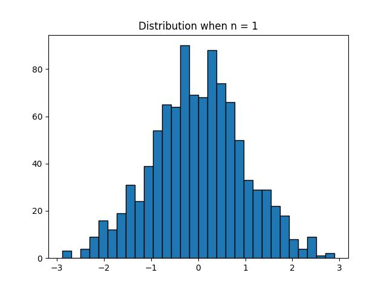</center></td>
        <td ><center>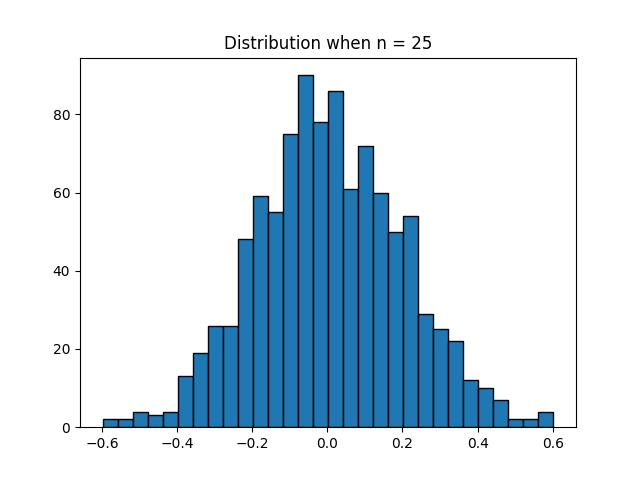</center></td>
    </tr>
</table>

<table>
    <tr>
        <td ><center>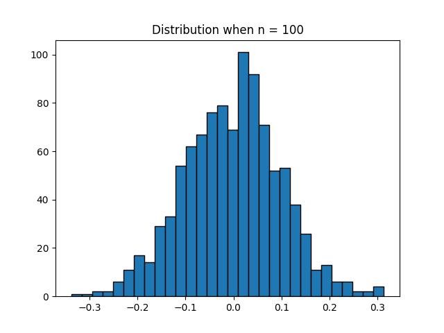</center></td>
        <td ><center>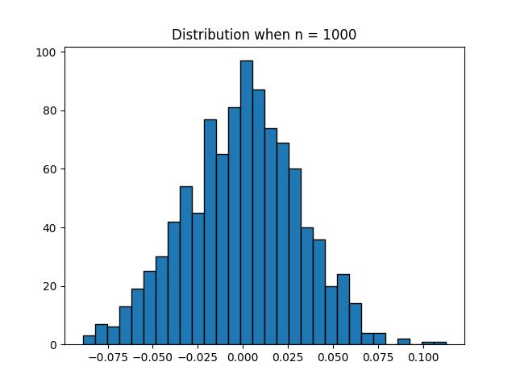</center></td>
    </tr>
</table>

(2) 当 $X_i$ 服从均匀分布时，仅需改动一行代码，如下：
```python
import numpy as np
import matplotlib.pyplot as plt

groups = 1000 # Perform 1000 samplings from \bar{X} to generate the chart
n = int(input("n ="))
nums = np.random.uniform(0, 1, size=(groups, n))

means = np.mean(nums, axis=1)

plt.hist(means, bins=30, edgecolor='black')
plt.title(f"Distribution when n = {n}")
plt.show()
```

绘得图像如下：
<table>
    <tr>
        <td ><center>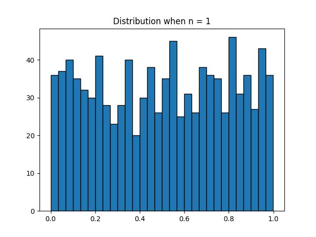</center></td>
        <td ><center>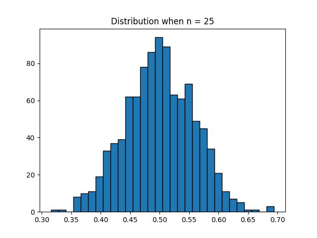</center></td>
    </tr>
</table>

<table>
    <tr>
        <td ><center>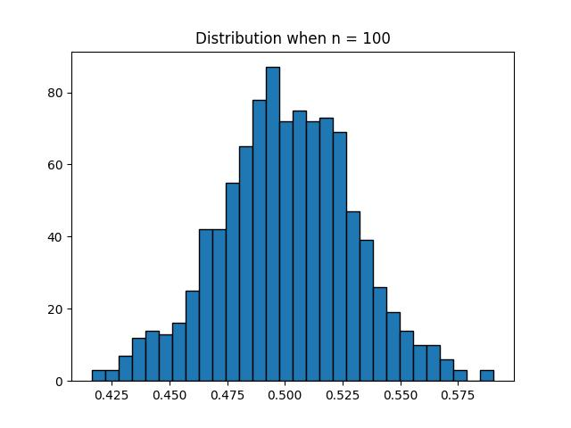</center></td>
        <td ><center>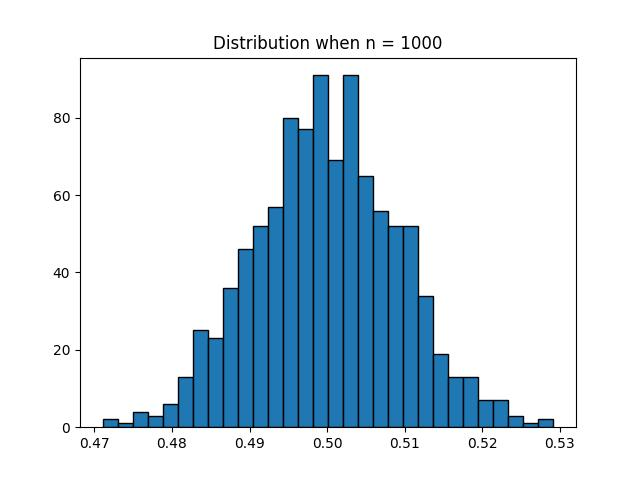</center></td>
    </tr>
</table>

(3) 代码如下：
```python
import numpy as np
import matplotlib.pyplot as plt

groups = 1000 # Perform 1000 samplings from \bar{X} to generate the chart
n = int(input("n ="))
nums = np.random.standard_cauchy((groups, n))

means = np.mean(nums, axis=1)
hist_range = (- 3 * np.std(means), 3 * np.std(means)) # let x = 0 be in the middle

plt.hist(means, range = hist_range, bins=50, edgecolor='black')
plt.title(f"Distribution when n = {n}")
plt.show()
```

绘得图像如下：
<table>
    <tr>
        <td ><center>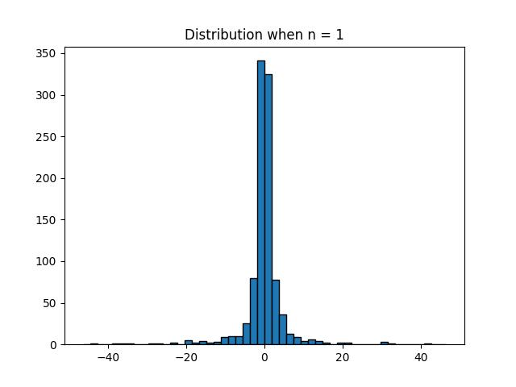</center></td>
        <td ><center>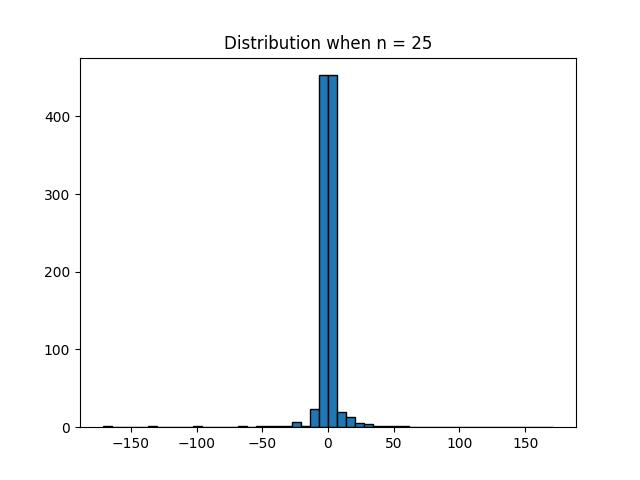</center></td>
    </tr>
</table>

<table>
    <tr>
        <td ><center>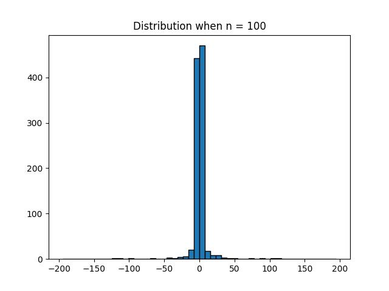</center></td>
        <td ><center>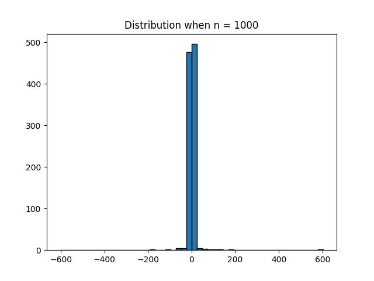</center></td>
    </tr>
</table>

根据中心极限理论，$\bar{X}$ 近似服从 $N(\mu,\cfrac{\sigma^2}{n})$，而对应于上述实验结果，不难发现，当 $n$ 逐渐增大时，图像逐渐近似于正态分布，且均值保持不变，而分布越来越集中于均值 $\mu$，这符合方差 $\cfrac{\sigma^2}{n}$ 逐渐缩小的预期。因此，以上的实验结果与中心极限定理相符。

 