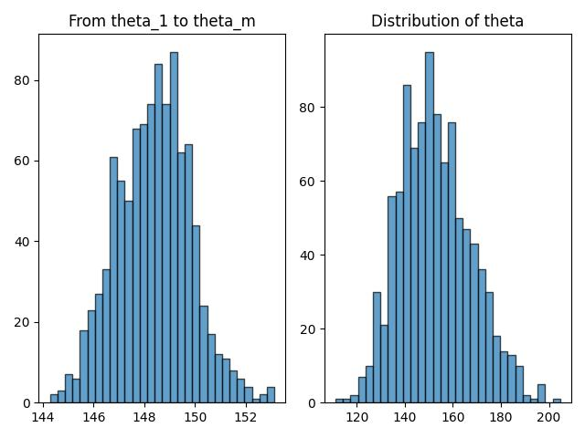

## HW10

#### Q1

(1) 证明：$\hat\sigma^2=\dfrac1n\sum_{i=1}^n(X_i-\bar X)^2=\dfrac1n\sum_{i=1}^n(X_i-\mu)^2-(\bar X-\mu)^2$

由 HW9-3(2) 知，$Var(\bar X)=\dfrac{\sigma^2}{n}\left(\dfrac{N-n}{N-1}\right)$，故

$$
\begin{align}
E(\hat\sigma^2)&=\dfrac1nE(\sum_{i=1}^n(X_i-\mu)^2)-E((\bar X-\mu)^2)\\
&=(\dfrac1n\sum_{i=1}^nE(X_i^2)-\mu^2)-(E(\bar X^2)-\mu^2)\\
&=\dfrac1n\sum_{i=1}^nE(X_i^2)-E(\bar X^2)\\
&=(\sigma^2+\mu^2)-(Var(\bar X)+\mu^2)\\
&=\sigma^2-\dfrac{\sigma^2}{n}\left(\dfrac{N-n}{N-1}\right)\\
&=\sigma^2\cdot\dfrac{n-1}{n}\cdot\dfrac{N}{N-1}
\end{align}
$$

(2) 假设无偏估计为 $\hat\theta$，则 $E(\hat\theta)=Var(\bar X)=\dfrac{\sigma^2}{n}\left(\dfrac{N-n}{N-1}\right)=\dfrac{N-n}{N(n-1)}\cdot E(\hat\sigma^2)$，因此无偏估计为 $\dfrac{N-n}{N(n-1)}\cdot E(\hat\sigma^2)$

#### Q2

(1) 证明：假设 $\hat g(x)$ 是对 $g(\lambda)$ 的一个无偏估计，那么 $E(\hat g(X))=e^{-2\lambda}$

所以 $\sum_{k=0}^n\dfrac{\lambda^ke^{-\lambda}}{k!}\hat g(k)=e^{-2\lambda}$，故 $\sum_{k=0}^n\dfrac{\lambda^k}{k!}\hat g(k)=e^{-\lambda}$

由泰勒展开式，$e^{-\lambda}=\sum_{k=0}^n\dfrac{(-\lambda)^k}{k!}$，因此 $\sum_{k=0}^n\dfrac{\lambda^k}{k!}\hat g(k)=\sum_{k=0}^n\dfrac{(-\lambda)^k}{k!}$

所以 $\hat g(X)=\left\{\begin{align}1,X\text{为偶数}\\-1,X\text{为奇数}\end{align}\right.$ 是 $g(\lambda)$ 的唯一无偏估计。

(2) 不合理。若 $X$ 为奇数，则对 $e^{-2\lambda}$ 的估计值为 $-1$，显然不正确。

根据上述推导，合理的估计一定不是无偏的，下面给出极大似然估计 $\hat g(X)$：

$L(\lambda)=\dfrac{\lambda^Xe^{-\lambda}}{X!}$，令 $\dfrac{\partial(\log L)}{\partial\lambda}=\dfrac X\lambda-1=0$，得 $\hat\lambda=X$

因此 $g(\lambda)$ 的 MLE 为 $e^{-2\lambda}$

#### Q3

(1) 证明：记 $Y=\max\{X_1,\cdots,X_n\},Z=\min\{X_1,\cdots,X_n\}$

则 $F_Y(y)=P(Y\le y)={P(X\le y)}^n=\left(\dfrac y\theta\right)^n,F_Z(z)=P(Z\le z)=1-{P(X\gt z)}^n=1-\left(1-\dfrac z\theta\right)^n$

所以 $f_Y(y)=F^{\\'}_Y(y)=\dfrac{ny^{n-1}}{\theta^n},f_Z(z)=F^{\\'}_Z(z)=\dfrac n\theta{\left(1- \dfrac{z}{\theta}\right)}^{n-1}$

所以 $E(Y)=\int_0^\theta yf_Y(y)dy=\int_0^\theta \dfrac{ny^n}{\theta^n}dy=\dfrac n{n+1}\theta,E(Z)=\int_0^\theta zf_Z(z)dz=\int_0^\theta \dfrac{nz(\theta-z)^{n-1}}{\theta^n}dz=\dfrac1{n+1}\theta$

所以 $E(\hat\theta_1)=E(Y)+E(Z)=\dfrac n{n+1}\theta+\dfrac1{n+1}\theta=\theta$

故 $\hat\theta_1$ 是 $\theta$ 的无偏估计。

(2) 证明：由 (1) 得 $E(Z)=\dfrac1{n+1}\theta$，令 $E(\hat\theta_2)=c_nE(Z)=\dfrac{c_n}{n+1}\theta=\theta$，解得 $c_n=n+1$

(3) 根据题意，$F_{Y,Z}(y,z)=P(Y\le y,Z\le z)$，令 $z^{\\'}=-z$，则 $F_{Y,Z^{\\'}}(y,z^{\\'})=P(Y\le y,Z\ge z)=(P(z\le X\le y))^n={\left(\dfrac{y-z}\theta\right)}^n$

所以 $f_{Y,Z}(y,z)=-\dfrac{\partial^2F_{Y,Z^{\\'}}(y,z^{\\'})}{\part y\part z}=\dfrac{n(n-1)(y-z)^{n-2}}{\theta^n}$

所以 $E(YZ)=\int_0^\theta\int_z^\theta yzf_{Y,Z}(y,z)dydz=\dfrac{n(n-1)}{\theta^n}\int_0^\theta\int_z^\theta yz(y-z)^{n-2} dydz=\dfrac{\theta^2}{n+2}$

所以 $Cov(Y,Z)=E(YZ)-E(Y)E(Z)=\dfrac{\theta^2}{n+2}-\dfrac{n\theta^2}{(n+1)^2}$

$Var(Y)=E(Y^2)-E^2(Y)=\int_0^\theta y^2\dfrac{ny^{n-1}}{\theta^n}dy-{\left(\dfrac{n\theta}{n+1}\right)}^2=\dfrac{n\theta^2}{n+2}-{\left(\dfrac{n\theta}{n+1}\right)}^2$

$Var(Z)=E(Z^2)-E^2(Z)=\int_0^\theta z^2\dfrac{n}{\theta}{\left(1-\dfrac{z}{\theta}\right)}^{n-1} dz-{\left(\dfrac{\theta}{n+1}\right)}^2=\dfrac{2\theta^2}{(n+1)(n+2)}-\dfrac{\theta^2}{(n+1)^2}$

于是，我们有

$$
\begin{align}
Var(\hat{\theta_1})&=Var(Y)+Var(Z)+2Cov(Y,Z)\\
&=\left(\dfrac{n\theta^2}{n+2}-{\left(\dfrac{n\theta}{n+1}\right)}^2\right)+\left(\dfrac{2\theta^2}{(n+1)(n+2)}-\dfrac{\theta^2}{(n+1)^2}\right)+2\left(\dfrac{\theta^2}{n+2}-\dfrac{n\theta^2}{(n+1)^2}\right)\\
&=\dfrac{2\theta^2}{(n+1)(n+2)}\\
Var(\hat{\theta_2})&=(n+1)^2Var(Z)=\dfrac n{n+2}\theta^2\\
Var(\hat{\theta_3})&=4Var(\bar X)=\dfrac 4nVar(X)=\dfrac{\theta^2}{3n}\\
Var(\hat{\theta_4})&={\left(\dfrac{n+1}{n}\right)}^2Var(Y)=\dfrac{\theta^2}{n(n+2)}
\end{align}
$$

因此，当 $n\gt2$ 时，有 $Var(\hat{\theta_2})\gt Var(\hat{\theta_3})\gt Var(\hat{\theta_1})\gt Var(\hat{\theta_4})$

#### Q4

(1) 证明：$E(\sum_{i=1}^nc_iX_i)=\sum_{i=1}^nc_iE(X_i)=\theta\sum_{i=1}^nc_i$

因此 $\sum_{i=1}^nc_iX_i$ 是 $\theta$ 的无偏估计当且仅当 $E(\sum_{i=1}^nc_iX_i)=\theta$，即 $\sum_{i=1}^nc_i=1$

(2) 证明：$Var(\sum_{i=1}^nc_iX_i)=\sum_{i=1}^nc_i^2Var(X_i)=\sigma^2\sum_{i=1}^nc_i^2$

欲求估计类的方差的最小值，即求 $\sum_{i=1}^nc_i^2$ 的最小值，又 $\sum_{i=1}^nc_i=1$，由柯西不等式，$\sum_{i=1}^n1^2\sum_{i=1}^nc_i^2\ge{\left(\sum_{i=1}^n(1\times c_i) \right)}^2=1$

故 $\sum_{i=1}^nc_i^2\ge\dfrac1n$，等号成立当且仅当 $c_1=\cdots=c_n=\dfrac 1n$

#### Q5

令 $Y=\dfrac1{\sigma^2}\sum_{i=1}^n(X_i-\bar X)^2=\sum_{i=1}^n{\left(\dfrac{X_i-\mu}{\sigma}\right)}^2-{\left(\dfrac{\bar X-\mu}{\sigma/\sqrt n}\right)}^2$

其中，$\dfrac{X_i-\mu}\sigma\sim N(0,1)$，而 $\dfrac{\bar X-\mu}{\sigma/\sqrt n}\sim N(0,1)$，故 $Y\sim\chi^2(n-1)$

所以 $m_2=\dfrac1n\sum_{i=1}^n(X_i-\bar X)^2=\dfrac{\sigma^2}nY,E(m_2)=\dfrac{n-1}n\sigma^2$

$$
\begin{align}
E((m_2-\sigma^2)^2)&=E(m_2^2)-2\sigma^2E(m_2)+\sigma^4\\
&=\dfrac{\sigma^4}{n^2}E(Y^2)-\dfrac{2\sigma^4}nE(Y)+\sigma^4\\
&=\dfrac{\sigma^4}{n^2}(2(n-1)+(n-1)^2)-\dfrac{2\sigma^4}n(n-1)+\sigma^4\\
&=\dfrac{2n-1}{2n}\sigma^4\\
E((S^2-\sigma^2)^2)&=E((S^2-E(S^2))^2)=Var(S^2)=\dfrac{\sigma^4}{(n-1)^2}Var(Y)=\dfrac{2\sigma^4}{n-1}
\end{align}
$$

因此 $E((m_2-\sigma^2)^2)\lt E((S^2-\sigma^2)^2)$

#### Q6

$Y=a\dfrac{X_i+X_2}{\sqrt{X_3^2+X_4^2}}=2a\dfrac{\frac{\sqrt2}{4}(X_1+X_2)}{\sqrt{(X_3^2+X_4^2)/2}}$，其中，$\dfrac{\sqrt2}{4}(X_1+X_2)\sim N(0,1),X_3^2+X_4^2\sim \chi^2(2)$

因此 $2a=1$，即 $a=\dfrac12$ 时，$Y\sim t(2)$，自由度为 $2$

#### Q7

设糖果重量 $X\sim N(\mu,\sigma^2)$，由于 $\mu,\sigma^2$ 未知，可知 $\mu$ 的一个置信区间为 $\left(\bar X-t_{\frac\alpha2}(n-1)\dfrac S{\sqrt n},\bar X+t_{\frac\alpha2}(n-1)\dfrac S{\sqrt n} \right)$，其中 $t_{\frac\alpha2}(n-1)$ 为 $t(n-1)$ 的上 ${\frac\alpha2}$-分位数

代入 $n=16,\alpha=0.05,\bar X=\dfrac1{16}\sum_{i=1}^{16}X_i=503.75,S^2=\dfrac1{15}\sum_{i=1}^{16}(X_i-\bar X)^2\approx38.47$，得到 $95\%$ 置信区间为 $(500.45,507.05)$，误差为 $(-3.3,+3.3)$，是在 $95\%$-置信意义下的

#### Q8

假设灯泡寿命 $X\sim(\mu,\sigma^2)$，由于 $\dfrac{\bar X-\mu}{S/\sqrt n}\sim t(n-1)$，我们有 $P(\mu\gt\hat\mu)=P(\dfrac{\bar X-\hat\mu}{S/\sqrt n}\gt\dfrac{\bar X-\mu}{S/\sqrt n})\ge1-\alpha$

所以 $\hat\mu\le\bar X-\dfrac S{\sqrt n}t_{\alpha}(n-1)$，其中 $t_{\alpha}(n-1)$ 是 $t(n-1)$ 的 上 $\alpha$-分位数

代入 $n=5,\alpha=0.05,\bar X=\dfrac15\sum_{i=1}^5X_i=1160,S^2=\dfrac14\sum_{i=1}^5(X_i-\bar X)^2=9950$，得其 $95\%$-置信下限为 $1064.9$

#### Q9

(1) 假设原催化剂得率 $X\sim N(\mu_1,\sigma^2)$，新催化剂得率 $X\sim N(\mu_2,\sigma^2)$，那么 $\dfrac{(\bar X-\bar Y)-(\mu_1-\mu_2)}{\sqrt{\dfrac{S_1^2}{n}+\dfrac{S_2^2}{m}}}\sim t(n+m-2)$

代入 $n=20,m=30$，由于 $n+m-2=48$ 足够大，可近似为 $N(0,1)$，因此近似认为 $\dfrac{(\bar X-\bar Y)-(\mu_1-\mu_2)}{\sqrt{\dfrac{S_1^2}{n}+\dfrac{S_2^2}{m}}}\sim N(0,1)$

故 $\mu1-\mu_2$ 的 $95\%$-置信区间为 $\bar X-\bar Y-\sqrt{\dfrac{S_1^2}{n}+\dfrac{S_2^2}{m}}z_{\frac\alpha2},\bar X-\bar Y+\sqrt{\dfrac{S_1^2}{n}+\dfrac{S_2^2}{m}}z_{\frac\alpha2}$

代入 $\alpha=0.05,\bar X=91.73,S_1^2=3.89,\bar Y=93.75,S_2^2=4.02$，可得 $95\%$-置信区间 $(-3.14,-0.90)$

(2) 由于有 $95\%$ 的把握认为两总体均值差的绝对值大于 $0.9$，可见两种催化剂存在显著区别。

#### Q10

证明：令 $Y=\max\{X_1,\cdots,X_n\}$，则由 3-(1) 得，$F_Y(y)={\left(\dfrac{y}{\theta}\right)}^n$

$\forall 0\lt\alpha\lt 1$，令 $P(Y\le\theta\le c_nY)=F_Y(\theta)\left(1-F_Y\left(\dfrac{\theta}{c_n}\right) \right)=1-F_Y\left(\dfrac{\theta}{c_n}\right)=1-{\left(\dfrac1{c_n}\right)}^n=1-\alpha$

解得 $c_n=\alpha^{-\frac1n}$，故存在这样的常数 $c_n$

#### Q11

代码如下：

```python
import math
import numpy as np
import matplotlib.pyplot as plt

# subtask 1
mu = 5
n = 100
data = np.random.normal(mu, 1, n)

def subtask23():
# subtask 2
    samples = np.random.choice(data, n, replace=True)
# subtask3
    mean = np.mean(samples)
    theta = math.exp(mean)
    return theta

# subtask 4
m = 1000
thetas = np.array([subtask23() for _ in range(m)])

# subtask 5
log_normal = np.random.lognormal(mu, 1/n, m)
plt.subplot(1, 2, 1)
plt.hist(log_normal, bins=30, edgecolor='black', alpha=0.7)
plt.title("From theta_1 to theta_m")

plt.subplot(1, 2, 2)
plt.hist(thetas, bins=30, edgecolor='black', alpha=0.7)
plt.title("Distribution of theta")

plt.tight_layout()
plt.show()

# subtask 6
V_boot = np.var(thetas)
var_theta = math.exp(2*(mu+(1/n))) - math.exp(2*mu + (1/n))
print(V_boot, var_theta)
```

其中的 $\hat{\theta}$ 服从对数正态分布，因此直接套用公式计算其方差。

(5) 绘得直方图如下所示：



两者图像较为接近，但由于 $\hat{\theta}_1^*,\cdots,\hat{\theta}_m^*$ 仅从 100 个样本中抽取，因此分布更为集中。

(6) 计算得到的 $V_{boot} = 220.369, \ Var(\hat{\theta})=223.594$，两者极为接近，故可以用 $V_{boot}$ 估计 $Var(\hat{\theta})$